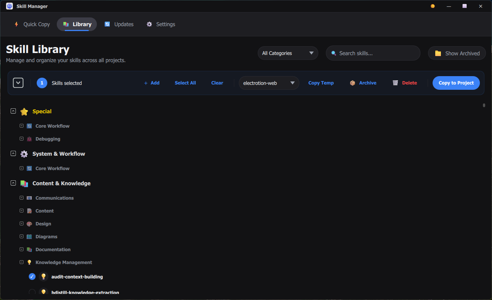
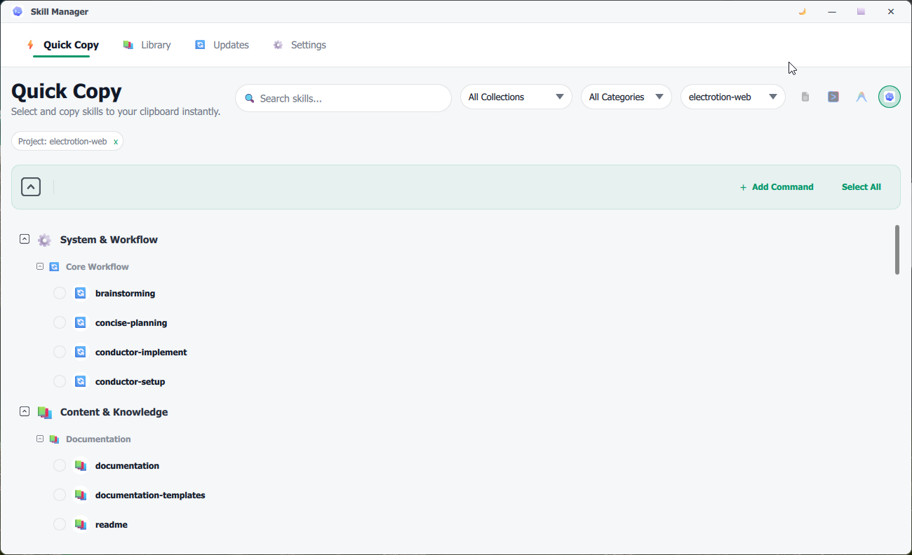
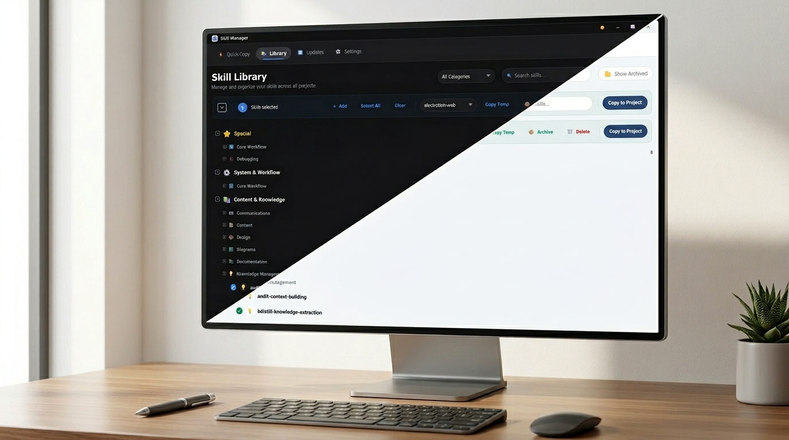

# SkillManager

  
   
  <b>A professional workspace to manage, sync, and deploy your AI agent skills.</b>

---

## 📺 Overview & Demo

<video src="https://github.com/user-attachments/assets/29541600-3647-474d-8a3e-98160cdd37ff" controls="controls" muted="muted" style="max-height:640px;"></video>
*Watch the 3-minute overview of SkillManager directly inline.*

---

## ✨ Key Features

SkillManager is designed for developers who need to manage growing libraries of AI skills across dozens of project repositories.

- **🚀 Quick Copy Workflow**: Instantly browse project-specific skills and copy formatted references directly to your clipboard.
- **🔄 Surgical Sync**: Intelligent synchronization that updates outdated skills across multiple repositories without full rescans.
- **📚 Centralized Library**: A single, searchable hub for all your markdown-based AI skills.
- **🎨 Modern UI**: Hardware-accelerated "Solid Matte & Liquid Glass" interface built with PySide6/QML.
- **📦 Zero-Config Entry**: Professional installers for Windows, macOS, and Linux.

---

## 📸 Visual Showcase

### The Central Library
Manage thousands of skills with ease. Filter by category, search instantly, and preview content in a high-fidelity editor.

### Quick Copy Integration
The ultimate developer companion. Keep your most-used skills just a click away while working in your IDE.

### Premium Design
Native Windows 11 integration (Mica/Acrylic) and a custom "Liquid Glass" design system provide a focused, distraction-free environment.

---

## 🚀 Getting Started

### For End Users
You don't need Python or any developer tools to use SkillManager.

1.  Visit the **[Releases](https://github.com/yourusername/SkillManager/releases)** page.
2.  Download the installer for your OS:
    -   **Windows**: `SkillManager_Setup.exe`
    -   **macOS**: `SkillManager_Portable_macos.zip`
    -   **Linux**: `SkillManager_Portable_linux.zip`
3.  Install and launch!

### For Developers
If you want to contribute or build from source, see our **[Development Guide](docs/DEVELOPMENT.md)**.

---

## 📖 Documentation

- **[User Guide](docs/USER_GUIDE.md)**: Detailed instructions on using every feature.
- **[Architecture](docs/ARCHITECTURE.md)**: How the app is built (Hub & Spoke).
- **[Design Philosophy](DESIGN.md)**: The "Solid Matte & Liquid Glass" guide.
- **[Categories](docs/CATEGORIES.md)**: How skills are auto-classified.
- **[Versioning & Releases](docs/VERSIONING.md)**: Our `x.y.z-dev.n` automation strategy and commit trigger words (e.g., `[patch]`, `[dev]`).

---

## 📄 License

MIT License

Copyright (c) 2026 Don Dishan Kanchuka Agalawatta
