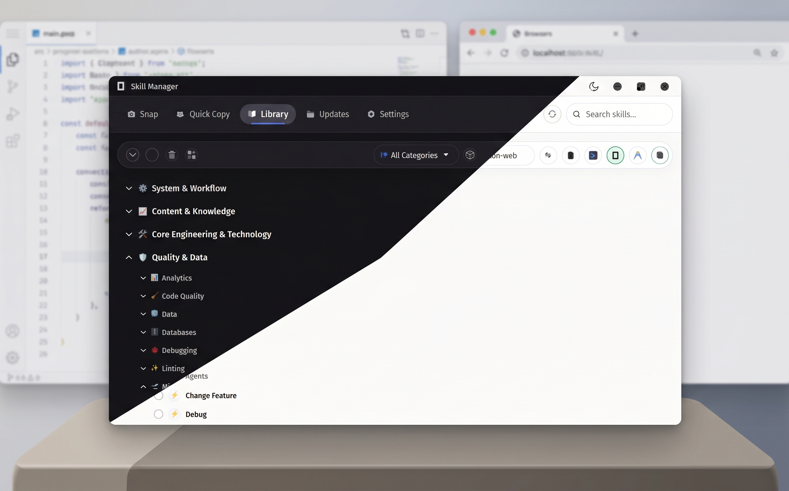
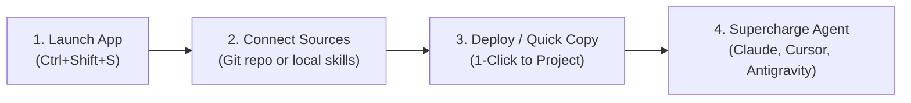
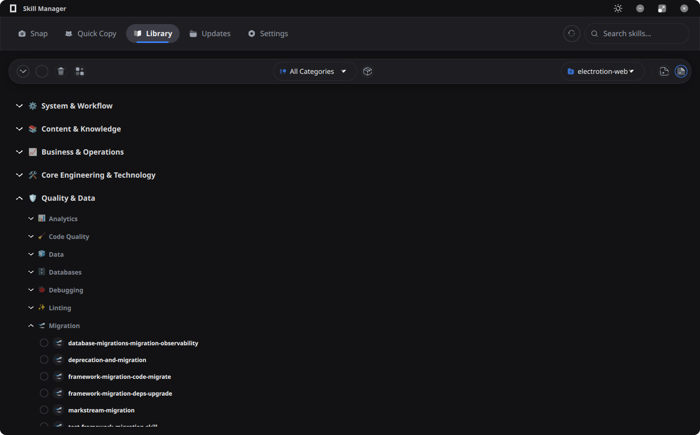
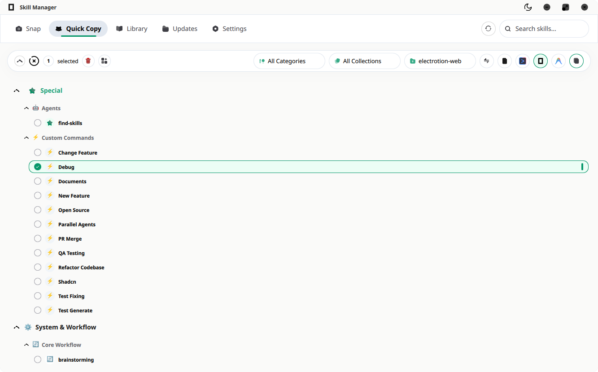
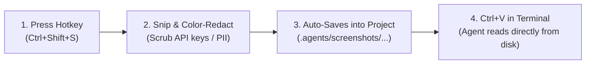
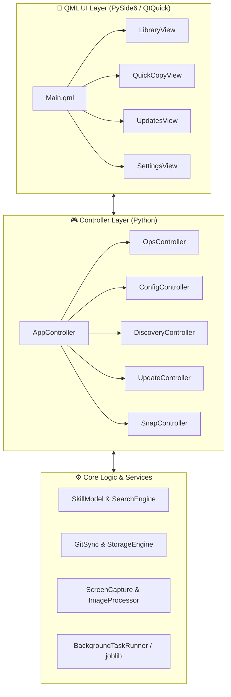

<div align="center">
  
  <h1>SkillManager</h1>
  <p><strong>The desktop command center for organizing, syncing, and deploying AI agent skills across your repositories.</strong></p>

  <p>
    <a href="https://python.org"></a>
    <a href="LICENSE"></a>
    <a href="pyproject.toml"></a>
    <a href="https://github.com/dishanagalawatta/SkillManager/actions/workflows/ci.yml"></a>
    <a href="https://github.com/dishanagalawatta/SkillManager/releases"></a>
    <a href="https://qt.io"></a>
  </p>

  <p>
    <a href="#-1-command-installation--updates"><strong>Install in 1 Command</strong></a> •
    <a href="#-see-it-in-action-demo"><strong>Watch Demo</strong></a> •
    <a href="#️-quick-start-your-first-60-seconds"><strong>First 60s Guide</strong></a> •
    <a href="#-core-capabilities"><strong>Key Features</strong></a> •
    <a href="#-snap-to-project-instant-visual-context-for-tui--terminal-agents"><strong>Snap to Project</strong></a> •
    <a href="#-supported-ai-agents--reference-formats"><strong>Agent Formats</strong></a> •
    <a href="#-developer--contributor-quickstart"><strong>Developer Guide</strong></a> •
    <a href="docs/README.md"><strong>Full Docs</strong></a>
  </p>
</div>

---

## 📺 See It In Action (Demo)

<div align="center">
  <video src="https://github.com/user-attachments/assets/29541600-3647-474d-8a3e-98160cdd37ff" controls="controls" muted="muted" width="100%" style="max-height: 640px; border-radius: 12px; box-shadow: 0 8px 24px rgba(0,0,0,0.2);"></video>
  <p><em>Watch the overview of SkillManager in action.</em></p>
</div>

<p align="center">
  
</p>

---

## 💡 Why SkillManager?

Modern AI coding agents (**Claude Code**, **Antigravity**, **Cursor**, **Gemini CLI**, **OpenCode**, **Codex**) are only as capable as the specialized skills, commands, and prompts you give them.

However, managing agent skills and multimodal context across multiple project repositories quickly becomes fragmented and painful:

| The Problem (Without SkillManager) | The Solution (With SkillManager) |
|---|---|
| ❌ **Skill Drift:** Improved prompts in one repo stay trapped there; other repos run stale skills. | ✅ **Central Library & Surgical Sync:** One unified source of truth. Updates propagate across repos in milliseconds. |
| ❌ **Manual Copy-Paste Overhead:** Manually copying `.agents/skills/` folders and forgetting required dependencies. | ✅ **1-Click Multi-Deploy:** Deploy single skills, custom collections, or `.md` commands to multiple projects simultaneously. |
| ❌ **Context Switching:** Digging through nested directories to find the exact skill reference syntax for your current IDE. | ✅ **Quick Copy Companion:** Global hotkey (`Ctrl+Shift+S`) to copy ready-to-paste references formatted for your active agent. |
| ❌ **Clumsy Multimodal Context for Terminal Agents:** Taking a screenshot, saving to Desktop, moving it into the repo, finding the path, and hoping no API keys were exposed. | ✅ **Snap to Project & PII Redaction:** Hotkey snips, color-redacts sensitive tokens, auto-saves directly to `<project>/.agents/screenshots/`, and copies the relative path for instant `Ctrl+V` into your TUI/CLI agent. |

---

## 🚀 1-Command Installation & Updates

No repository cloning, virtual environment setup, or build toolchains required. Get started immediately:

> Every downloaded artifact is verified against the release's `SHA256SUMS` manifest before installation.

### 🐧 Ubuntu / Debian (Recommended)

```bash
# Install / Upgrade to latest version
curl -fsSL https://raw.githubusercontent.com/dishanagalawatta/SkillManager/main/scripts/install.sh | bash

# Check & Apply Updates anytime
curl -fsSL https://raw.githubusercontent.com/dishanagalawatta/SkillManager/main/scripts/install.sh | bash -s -- --update

# Clean Uninstall (--purge removes settings and cache)
curl -fsSL https://raw.githubusercontent.com/dishanagalawatta/SkillManager/main/scripts/install.sh | bash -s -- --uninstall
```

### 📦 Other Linux Distros (Portable AppImage)

```bash
# Install / Upgrade portable AppImage
curl -fsSL https://raw.githubusercontent.com/dishanagalawatta/SkillManager/main/scripts/install.sh | bash -s -- --appimage

# Uninstall
curl -fsSL https://raw.githubusercontent.com/dishanagalawatta/SkillManager/main/scripts/install.sh | bash -s -- --uninstall
```

### 🪟 Windows (winget or Setup.exe)

```powershell
# Install via Windows Package Manager (Verified, No SmartScreen warning)
winget install --id dishanagalawatta.SkillManager -e --source winget

# Upgrade
winget upgrade --id dishanagalawatta.SkillManager

# Uninstall
winget uninstall --id dishanagalawatta.SkillManager
```
*(Alternatively, download `SkillManager_Setup.exe` directly from [GitHub Releases](https://github.com/dishanagalawatta/SkillManager/releases)).*

---

## ⏱️ Quick Start: Your First 60 Seconds

Get productive in 4 straightforward steps:


```mermaid
flowchart LR
    A["1. Launch App\n(Ctrl+Shift+S)"] --> B["2. Connect Sources\n(Git repo or local skills)"]
    B --> C["3. Deploy / Quick Copy\n(1-Click to Project)"]
    C --> D["4. Supercharge Agent\n(Claude, Cursor, Antigravity)"]
```

1. **Launch SkillManager**: Open the app from your application launcher or press the global shortcut (`Ctrl+Shift+S`).
2. **Add Your Skill Sources**: In **Settings** (or by dragging a folder into **Updates**), connect your central skills Git repository and local project folders.
3. **Deploy or Copy Reference**:
   - In **Library**, select skills and click **Copy to Projects** to install them.
   - In **Quick Copy**, click **Copy Reference** next to any skill to paste it formatted directly into your active prompt.
4. **Code with Supercharged Agents**: Your AI coding agent loads the exact specialized skill instructions on demand.

---

## 🌟 Core Capabilities

### 1. Central Skill Library & Inspector
Manage thousands of agent skills with instant fuzzy search, automatic category detection, and deep Markdown inspection.

<p align="center">
  
</p>

- **Instant Search & Intelligent Tagging**: Real-time fuzzy filtering powered by `rapidfuzz`. Automatically organizes skills into Architecture, Testing, Security, CRO, UI, and Marketing.
- **Rich Skill Inspector**: Read full skill documentation, preview raw Markdown, inspect parameters, and view trigger keywords.
- **Custom Project Commands**: Turn any skill into an actionable `.md` slash command with custom emojis, multi-project deployment, and smart duplicate detection.
- **Multi-Select Batch Actions**: Star favorites, archive unused skills, or deploy collections across all repositories at once.

---

### 2. Quick Copy & Format Switcher
Your daily companion during active development sessions.

<p align="center">
  
</p>

- **1-Click Reference Copying**: Copies syntax tailored to your active agent format (`@.agents/skills/my-skill/SKILL.md`, `/command`, or Plaintext).
- **Fast Project Cycling**: Seamlessly switch between active project repositories with the one-click project swap button.
- **Automatic Command Dependency Carry**: When copying a command that relies on helper skills (e.g., `/git-pr` requiring `@cavecrew`), SkillManager automatically detects missing skills in the target project and offers to copy them together.

---

### 3. Surgical Git Synchronization
Keep your skill ecosystem synchronized without manual pulling or broken symlinks.

- **Intelligent Diff & Sync**: Compares version fingerprints across your central library and all connected projects to pinpoint exactly which skills are outdated.
- **Automatic Skill Linking**: Adding existing project directories automatically detects and links matching skills to upstream packages.
- **Non-Blocking Multiprocessing**: Heavy scanning, parsing, and Git operations run silently on background workers via `joblib.Parallel`—the desktop UI stays silky smooth at 60 FPS.

---

### 4. 📸 "Snap to Project": Instant Visual Context for TUI & Terminal Agents
Modern terminal and TUI coding agents (**Claude Code**, **Antigravity**, **Gemini CLI**, **OpenCode**, **Codex**) have powerful multimodal capabilities—but getting visual screenshots into terminal prompts without friction used to be painful.

SkillManager solves this with a dedicated **Snap-to-Project** workflow:


```mermaid
flowchart LR
    A["1. Press Hotkey\n(Ctrl+Shift+S)"] --> B["2. Snip & Color-Redact\n(Scrub API keys / PII)"]
    B --> C["3. Auto-Saves into Project\n(.agents/screenshots/...)"]
    C --> D["4. Ctrl+V in Terminal\n(Agent reads directly from disk)"]
```

- **Auto-Saved Directly to Active Project**: When you snap an area of your screen, SkillManager saves the image directly inside your project repository at `<project_path>/.agents/screenshots/Screenshot_<timestamp>.png`.
- **Instant Path Copied to Clipboard**: SkillManager automatically puts the exact client-formatted relative path (e.g. `@.agents/screenshots/Screenshot_20260819_190000.png` or `/.agents/screenshots/...`) straight onto your clipboard.
- **1-Keystroke Terminal Prompting**: Switch to your terminal/TUI coding platform and press `Ctrl+V`. The AI agent immediately has direct filesystem access to read the image—zero file hunting or dragging needed.
- **Pixel-Level Color PII Redaction**: Isolate and scrub specific pixel colors (passwords, tokens, customer names) before saving, ensuring private data never leaks to LLMs.
- **Library & Quick Copy Integration**: All captured snaps are automatically indexed under the **Snaps** category for quick recall and cross-project reuse.

---

## 🔌 Supported AI Agents & Reference Formats

SkillManager formats references to match whatever AI toolchain your team uses:

| Agent / Tool | Skill Reference Syntax | Snap / Screenshot Syntax |
|---|---|---|
| **Antigravity** | `@.agents/skills/<name>/SKILL.md` | `@.agents/screenshots/Screenshot_<ts>.png` |
| **Claude Code & Desktop** | `.agents/skills/<name>/SKILL.md` | `.agents/screenshots/Screenshot_<ts>.png` |
| **Cursor & VS Code** | `@<skill-name>` | `@.agents/screenshots/Screenshot_<ts>.png` |
| **Gemini CLI** | `/path/to/skill` | `/.agents/screenshots/Screenshot_<ts>.png` |
| **OpenCode & Codex** | `/command-name` | `.agents/screenshots/Screenshot_<ts>.png` |
| **Plaintext / Custom** | Standard file paths | Full file path |

---

## ⌨️ Keyboard Shortcuts Cheat Sheet

All shortcuts can be re-mapped in **Settings**:

| Shortcut (Default) | Action | Context |
|---|---|---|
| `Ctrl+Shift+S` | **Snap to Project & Color Redact (Global)** | Global Desktop / App |
| `Ctrl+F` | **Focus Search Bar** | Library & Quick Copy |
| `Ctrl+C` | **Copy Formatted Reference** | Focused Skill |
| `Ctrl+A` | **Select All Visible Skills** | Library View |
| `Alt+1` / `Alt+2` | **Switch between Quick Copy & Library** | Global in App |
| `Alt+3` / `Alt+4` | **Switch between Updates & Settings** | Global in App |
| `Ctrl+T` | **Toggle Dark / Light Theme** | Global in App |
| `Ctrl+Shift+X` | **Archive Selected Skills** | Library View |
| `F5` | **Trigger Manual Cache Refresh** | All Views |

---

## 🛠️ Developer & Contributor Quickstart

If you want to contribute, build from source, or customize SkillManager:

### 1. Prerequisites
- **Python ≥ 3.12**
- **[uv](https://github.com/astral-sh/uv)** (fast Python package manager)
- *(Linux only)* Qt 6 system libraries:
  ```bash
  sudo apt install -y libglib2.0-0 libxcb-cursor0 libxkbcommon-x11-0
  ```

### 2. Clone & Run Locally
```bash
git clone https://github.com/dishanagalawatta/SkillManager.git
cd SkillManager
uv sync
uv run skill-manager
```

### 3. Run Quality Suite
```bash
# Run linting and formatting
uv run ruff check src tests --fix
uv run ruff format src tests

# Run test suite in parallel
uv run pytest -n auto --dist loadfile

# Run complete development verification script
python scripts/dev_test.py
```

### 4. Internal Developer Tooling (MCP Bridge)
For automated testing, controller introspection, and headless workflows during development, SkillManager includes an internal stdio MCP server bridge:
```bash
uv run skill-manager --mcp
```
See [docs/MCP_SERVER.md](docs/MCP_SERVER.md) for the internal tool reference and developer architecture.

### 5. Build Binaries
```bash
# Build standalone executable with PyInstaller
uv run skill-manager-build

# Build Linux .deb and AppImage packages
uv run skill-manager-build linux
```

---

## 🏗️ Architecture

SkillManager follows a layered architecture separating UI presentation, controller orchestration, and background worker services:


```mermaid
flowchart TD
    subgraph UI ["🎨 QML UI Layer (PySide6 / QtQuick)"]
        A[Main.qml] --> B[LibraryView]
        A --> C[QuickCopyView]
        A --> D[UpdatesView]
        A --> E[SettingsView]
    end

    subgraph Controllers ["🎮 Controller Layer (Python)"]
        F[AppController]
        F --> G[OpsController]
        F --> H[ConfigController]
        F --> I[DiscoveryController]
        F --> J[UpdateController]
        F --> K[SnapController]
    end

    subgraph Core ["⚙️ Core Logic & Services"]
        L[SkillModel & SearchEngine]
        M[GitSync & StorageEngine]
        N[ScreenCapture & ImageProcessor]
        O[BackgroundTaskRunner / joblib]
    end

    UI <--> Controllers
    Controllers <--> Core
```

See [docs/ARCHITECTURE.md](docs/ARCHITECTURE.md) and [DESIGN.md](DESIGN.md) for architectural deep-dives.

---

## ⚙️ Configuration & Environment

SkillManager works out of the box with sensible defaults. Optional settings can be configured via `.env`:

| Variable | Default | Description |
|---|---|---|
| `SKILL_MANAGER_LOG_LEVEL` | `INFO` | Logging verbosity (`DEBUG`, `INFO`, `WARNING`, `ERROR`) |
| `SKILL_MANAGER_DATA_DIR` | (system default) | Custom directory for user settings and local database |
| `QT_QPA_PLATFORM` | native | Set `offscreen` for headless CI runs |
| `POSTHOG_PROJECT_TOKEN` | *(empty)* | Optional opt-in analytics token |
| `SENTRY_DSN` | *(empty)* | Optional opt-in crash reporting DSN |

See [docs/ENVIRONMENT.md](docs/ENVIRONMENT.md) for full environment documentation.

---

## ❓ Troubleshooting FAQ

<details>
<summary><strong>Q: Linux shows "Could not load the Qt platform plugin 'xcb'"</strong></summary>

Install the missing XCB cursor library:
```bash
sudo apt install -y libxcb-cursor0
```
</details>

<details>
<summary><strong>Q: Global screenshot hotkey isn't responding on Wayland</strong></summary>

Wayland requires the desktop portal backend for global shortcut capture:
```bash
sudo apt install -y xdg-desktop-portal xdg-desktop-portal-gnome # or -kde
```
You can also trigger screenshots directly via the camera icon in the SkillManager top bar.
</details>

<details>
<summary><strong>Q: How do I backup my custom collections and project links?</strong></summary>

All configuration is stored locally as standard JSON under your user data directory (`~/.config/SkillManager` on Linux or `%APPDATA%\SkillManager` on Windows). You can back up or migrate this directory at any time.
</details>

<details>
<summary><strong>Q: I updated, but "skill-manager" still runs the old version in my terminal</strong></summary>

A leftover binary from a previous AppImage install (or a development symlink) at `~/.local/bin/skill-manager`
takes precedence over the system package whenever `~/.local/bin` is before `/usr/bin` in your `PATH`.
Remove it to use the updated packaged version:
```bash
rm -f ~/.local/bin/skill-manager
```
</details>

---

## 🔒 Privacy, Security & Telemetry Notice

- **100% Opt-in Telemetry**: Telemetry (PostHog / Sentry) is **disabled by default**. It is only active if you explicitly configure tokens in `.env`.
- **Zero Token/Prompt Leaks**: SkillManager **never** logs API tokens, credentials, or custom skill prompt contents.
- **Open Markdown Standard**: Skills and commands are stored as plain Markdown files (`SKILL.md`, `.md`) on your local filesystem—zero proprietary database lock-in.

See [docs/SECURITY.md](docs/SECURITY.md) for our full security policy.

---

## ⚖️ License & Trademark Disclaimers

- **License**: SkillManager is open-source software licensed under the [MIT License](LICENSE).
- **Trademark Notice**: *Claude* is a trademark of Anthropic PBC. *Gemini* is a trademark of Google LLC. *Cursor* is a trademark of Anysphere Inc. *VS Code* is a trademark of Microsoft Corporation. All other product and company names are trademarks™ or registered® trademarks of their respective holders. Use of them does not imply any affiliation, sponsorship, or endorsement.

---

## 🤝 Contributing & Community

Contributions are warmly welcome! Whether fixing a bug, adding new agent client formats, or improving documentation:

1. Check out our [Contributing Guidelines](docs/CONTRIBUTING.md).
2. Review our [Architecture Decisions (ADRs)](ADR_INDEX.md).
3. Open a Pull Request or start a discussion.

<div align="center">
  <p>Made with ❤️ for the AI agent & developer tooling community.</p>
</div>
