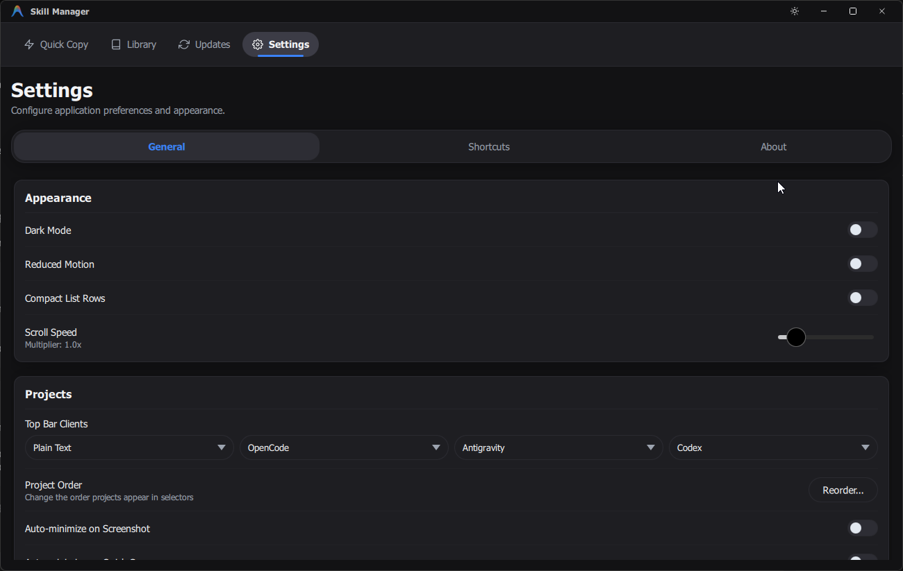

# 1. Project Metadata

* **Project Name:** CourseBar
* **Important Links:**
  * [Code Repository](https://github.com/dishanagalawatta/SkillManager)
  * [README](README.md)
  * [DESIGN](DESIGN.md)
  * [Environment](docs/ENVIRONMENT.md)
  * [Development](docs/DEVELOPMENT.md)
  * [ARCHITECTURE](docs/ARCHITECTURE.md)
  * [API](docs/API.md)
  * [VERSIONING](docs/VERSIONING.md)

---

# 2. High-Level Milestones

* **Goal A:** Patch Things up
* **Goal B:** Cover Backlog

---

# 3. Active Task Tracker

## To Do (Ready for Pickup)

- [ ] `[P1]` Develop automated reply method for GitHub issues
- [ ] `[P99]` Improve Test Coverage

## In Progress

- [ ] **[High Severity]** fix failing github actions

---

# 4. Bug Tracker

* [X] Package update not working.
* [ ] updated command does not show in ui until app restart. ui (command inspector) need to update immediately after updating a command.
* [ ] Selected items does not remeber on restart. it always select 3 items.
* [ ] dark mode toggle does not update imediately when i press top bar icon to update mode.

---

# 5. Icebox / Backlog
