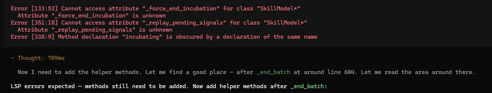

# 1. Project Metadata

* **Project Name:** CourseBar
* **Important Links:**
  * [Code Repository](https://github.com/dishanagalawatta/SkillManager)
  * [README](README.md)
  * [DESIGN](DESIGN.md)
  * [Environment](docs/ENVIRONMENT.md)
  * [Development](docs/DEVELOPMENT.md)
  * [ARCHITECTURE](docs/ARCHITECTURE.md)
  * [API](docs/API.md)
  * [VERSIONING](docs/VERSIONING.md)

---

# 2. High-Level Milestones

* **Goal A:**
* **Goal B:**

---

# 3. Active Task Tracker

## To Do (Ready for Pickup)

* [ ] Autodetect skills mentioned in commands, carry (prompt user) skills when copy command to other projects.

## In Progress

- [ ] **[High Severity]** fix failing github actions

---

# 4. Bug Tracker

test command copy to other projects.

---

# 5. Icebox / Backlog
