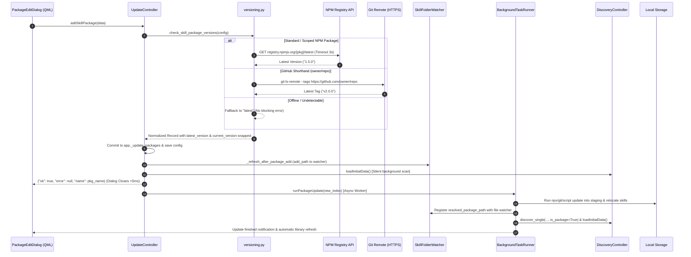
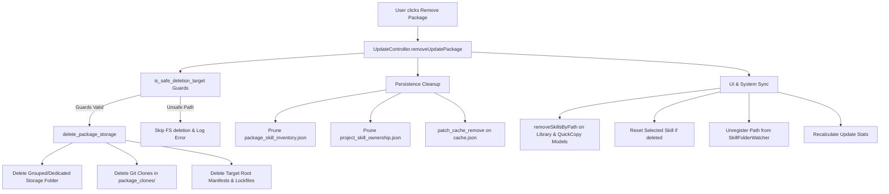
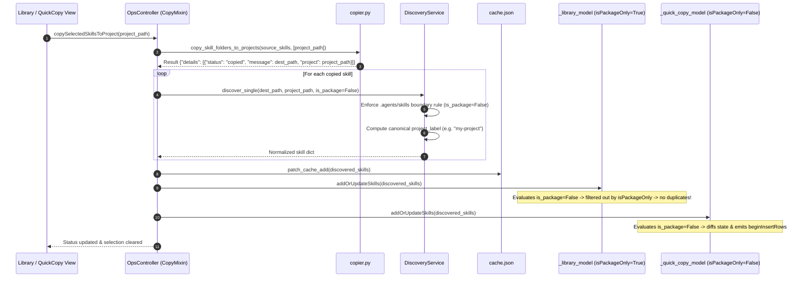
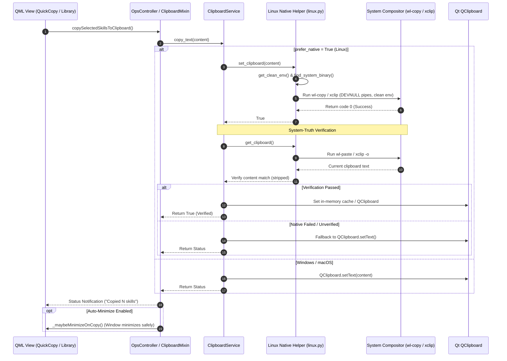
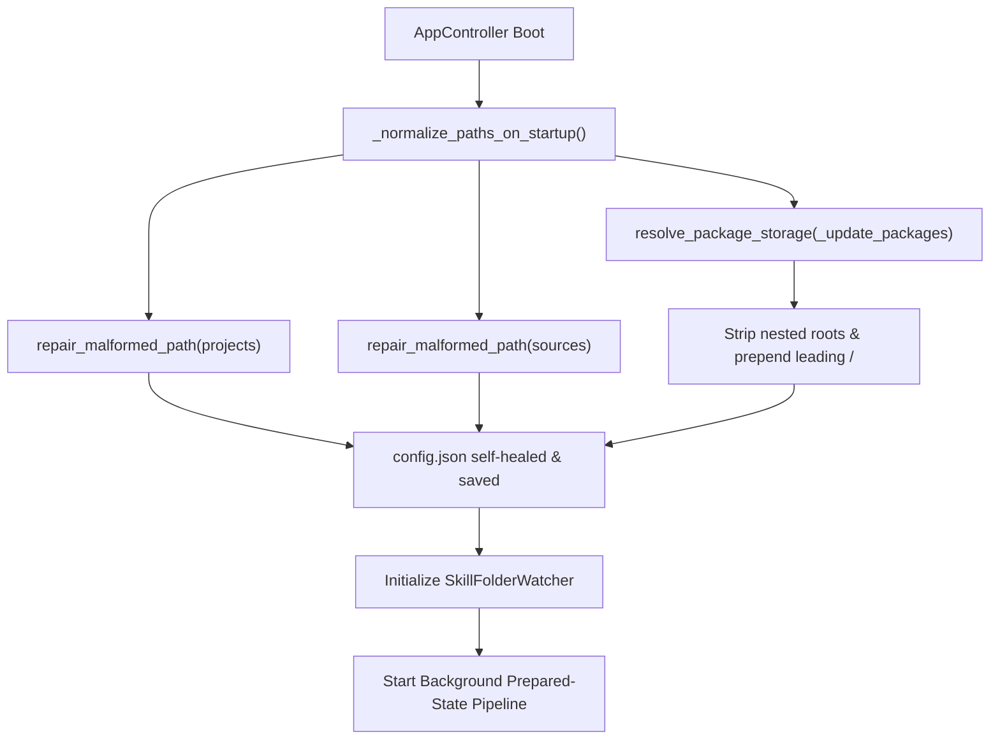
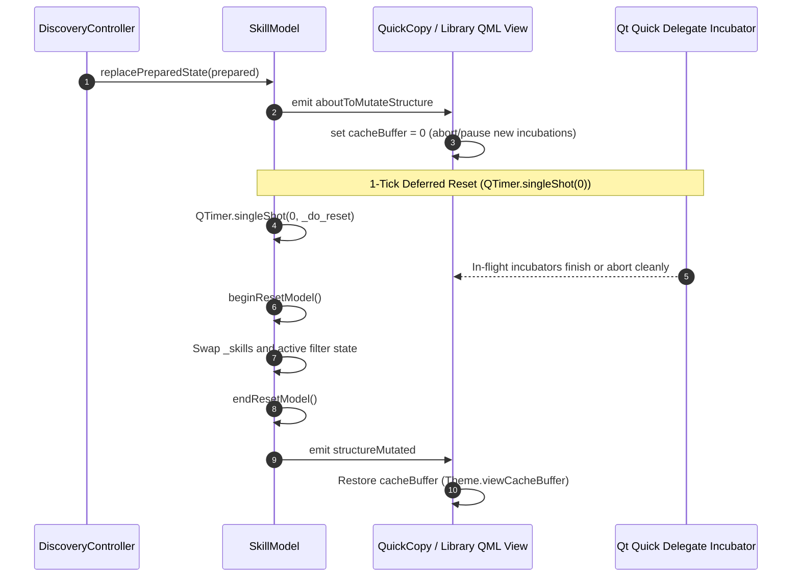
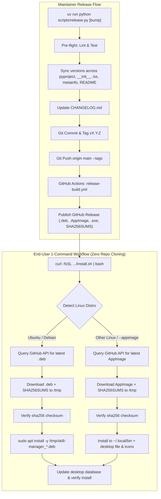

# SkillManager Architecture

> Status: **Accepted** | Last reviewed: 2026-08-20
> Related ADRs: [ADR-0010](adr/ADR-0010-drop-tuf.md), [ADR-0019](adr/ADR-0019-multiprocessing-joblib.md), [ADR-0024](adr/ADR-0024-dual-write-clipboard-verification.md), [ADR-0025](adr/ADR-0025-selection-persistence-shutdown-sync.md), [ADR-0027](adr/ADR-0027-path-self-healing-and-two-phase-incubation.md), [ADR-0028](adr/ADR-0028-non-blocking-package-versioning-and-npx-resolution.md), [ADR-0029](adr/ADR-0029-package-deletion-storage-cleanup.md), [ADR-0030](adr/ADR-0030-project-skill-classification-and-diff-model-sync.md)


SkillManager is a Windows desktop application designed to manage, organize, and synchronize reusable agent skills across multiple project repositories. It is built using Python for the core logic and PySide6/QML for a modern, hardware-accelerated user interface.

## System Overview

The application is structured into four primary layers:

```
┌─────────────────────────────────────────────────────────┐
│  QML UI Layer (SkillManagerComponents/)                 │
│  Theme.qml · Main.qml · views/ · dialogs/ · components │
├─────────────────────────────────────────────────────────┤
│  Controller Layer (app.py + controllers/)               │
│  AppController → Config · Discovery · Ops · UI · ...   │
├─────────────────────────────────────────────────────────┤
│  Core Logic (core/)                                     │
│  Parsing · Models · Config · Copier · Discovery · ...   │
├─────────────────────────────────────────────────────────┤
│  Utils (utils/)                                         │
│  Threading · Task Runner · Win32                        │
└─────────────────────────────────────────────────────────┘
```

---

## 1. Hub & Spoke Controllers (`controllers/`)

To prevent `AppController` from becoming a "God Object," responsibilities are distributed into sub-controllers:

| Controller | Module | Purpose |
|------------|--------|---------|
| `UIController` | `ui_controller.py` | Application-wide UI state, window geometry, asset URI resolution |
| `SelectedSkillController` | `selected_skill_controller.py` | Live-bound QObject managing currently and last selected skill properties |
| `ConfigController` | `config_controller.py` (facade over `config/` mixins) | `ConfigManager` instance, skill sources, projects, shortcuts |
| `OpsController` | `ops_controller.py` (facade over `ops/` mixins) | Copy, delete, archive, restore, starred state, custom commands |
| `UpdateController` | `update_controller.py` | Background sync, Git source updates, progress reporting |
| `DiscoveryController` | `discovery_controller.py` | Filesystem scanning, project discovery, prepared-state pipeline |
| `ScreenshotController` | `screenshot_controller.py` | Screen capture, region selection, PII redaction |
| `ImageInspectorController` | `image_inspector_controller.py` | Color isolation, pixel inspection |
| `AppUpdateController` | `app_update_controller.py` | App self-update via GitHub Releases API |

### Registration & Meta-Object Signal Inheritance

```python
qmlRegisterSingletonInstance(AppController, "App", 1, 0, "AppController", controller)
engine.rootContext().setContextProperty("appController", controller)
```

QML consumers reach it via `import App 1.0` or the `appController` context property.

**Mixin Signal Inheritance Pattern**: Facade controllers (such as `ConfigController`) inherit from specialized domain mixins (`SettingsMixin`, `ShortcutsMixin`, `ProjectsMixin`, `CollectionsMixin`). Class-level `Signal` instances associated with `@Property(..., notify=...)` decorators are declared on the respective mixins. The composing facade inherits these class attributes without re-declaring them as class-level attributes, guaranteeing PySide6's Qt Meta-Object registration accurately routes property change notifications to QML bindings.

---

## 2. Data Models (`core/models/`)

| File | Class | Purpose |
|------|-------|---------|
| `entities.py` | `SkillEntity`, `CommandEntity`, etc. | Core data classes (Pydantic models) |
| `filter_engine.py` | `FilterEngine` | Category, text, client, starred/archived filtering |
| `qt_model.py` | `SkillModel` | `QAbstractListModel` subclass for QML binding (facade over `roles`, `selection`, `pipeline`, `incubation`, `collapse`, `ingest` mixins) |

`SkillModel` implements optimized filtering and selection, supporting thousands of skills without UI lag.

---

## 3. Core Services (`core/`)

### Parsing Engine (`core/parsing/`)

| File | Purpose |
|------|---------|
| `base.py` | Common parsing utilities (markdown extraction, normalization) |
| `categorizer.py` | Auto-classification via weighted keyword frequency |
| `command.py` | Custom command markdown parsing |
| `constants.py` | Category definitions and keyword mappings |
| `skill.py` | Skill markdown frontmatter extraction |

### Key Services

| Service | Module | Purpose |
|---------|--------|---------|
| `DiscoveryService` | `discovery.py` | Filesystem scanning → model population |
| `UpdateService` | `update_service.py` | Version comparison, surgical file updates, exact-match project-skill ownership linking |
| `ConfigManager` | `config.py` | JSON-based `config.json` persistence |
| `SkillFolderWatcher` | `file_watch.py` | Watchdog-based filesystem monitoring |
| `BackgroundTaskRunner` | `utils/task_runner.py` | Concurrent background task execution |
| `Copier` | `copier.py` | File copy operations, command-skill carry |
| `SkillReferences` | `skill_references.py` | Skill dependency detection |
| `SearchEngine` | `search.py` | Fast skill lookup index |
| `DiskCache` | (via `diskcache`) | Expensive computation caching |

### Skill Packages (`core/skill_packages/`)

| File | Purpose |
|------|---------|
| `config.py` | Package configuration, defaults, command normalization |
| `process.py` | Subprocess execution pipeline with token sanitization |
| `relocator.py` | Skill relocation logic from staging to target paths |
| `storage.py` | Package storage management and path conflict detection |
| `updater.py` | Staging area execution and update pipelines |
| `versioning.py` | Non-blocking multi-protocol version detection (ADR-0028) |

#### Real-Time Protocol and Display Name Auto-Detection
The package creation dialog (`PackageEditDialog.qml`) integrates directly with `infer_package_metadata()` and `humanize_slug()` in `config.py` via `AppController.detectPackageMetadata()`. When a user types or pastes into the primary package/URL/command input:
1. **Protocol Inference**: URLs (`https://`, `git@`, `.git`) dispatch to `git`, shell prefixes (`bash `, `./`, `python `) dispatch to `custom`, and npm scopes or slugs dispatch to `npx`.
2. **Display Name Humanization**: Slugs are stripped of leading scopes, split along delimiters (`-`, `_`, `/`), and capitalized into human-readable titles (e.g. `vercel-labs/find-skills` $\rightarrow$ `Find Skills`, `agentic-awesome-skills` $\rightarrow$ `Agentic Awesome Skills`).
3. **Canonical Repository Mapping & Self-Healing**: Shorthand aliases and meta-skill names (e.g., `vercel-labs/find-skills`) are canonicalized via `KNOWN_SKILL_REPO_ALIASES` to their upstream source repository (`vercel-labs/skills`) for backend execution while preserving the user's specific display title (`Find Skills`).
4. **Headless Non-Interactive Flags**: `skills add` commands are automatically augmented with `-y` (or `--all`) to prevent subprocess terminal blocking.
5. **User-Edit Preservation**: Manual edits in the Display Name or Protocol fields set explicit override flags (`userEditedName`, `userEditedProtocol`), guaranteeing the user's manual choices are preserved unless explicitly cleared.

#### Non-Blocking Multi-Protocol Package Addition (ADR-0028)

Skill package registration uses a non-blocking multi-protocol probe pipeline designed to eliminate Qt event loop freezes and prevent OS "Not Responding" modals:

1. **Direct HTTP NPM Registry Lookup**: Uses `fetch_npm_registry_version()` to query `registry.npmjs.org` with a 3-second timeout for scoped (`@scope/pkg`) and standard npm packages in <100ms without shell overhead.
2. **GitHub Shorthand Resolution**: Automatically detects `owner/repo` formats (e.g. `vercel-labs/skills`) and probes remote repository tags or HEAD commits via HTTPS.
3. **Graceful Fallback & Snap**: Unresolvable or offline packages default to `"latest"` and snap `current_version`, enabling immediate registration with "Up to Date" status while actual downloads execute on `BackgroundTaskRunner`.



#### Reactive Package File Watching & Instant Library Refresh
When a skill package is added (`addSkillPackage`, `addUpdatePackage`) or updated (`runPackageUpdate`):
1. **Dynamic Watcher Registration**: The package's resolved storage directory (`resolved_package_path`) is registered with `SkillFolderWatcher.add_path()`. This attaches inotify/ReadDirectoryChanges watchers immediately to detect subsequent on-disk modifications.
2. **Typed Single-Skill Discovery**: During incremental folder extraction, `DiscoveryService.discover_single(path, is_package=True)` enforces `is_package=True` and `project_label="Master Library"`, ensuring skills are immediately visible in the Library model (`isPackageOnly = True`).
3. **Automated Discovery Refresh**: Upon completion, `DiscoveryController.loadInitialData()` runs the full background discovery pipeline asynchronously, atomically syncing category headers, search engine indices, and filter models via `PreparedModelState`.

#### Lockfile Lifecycle & `skills` CLI Interoperability
When packages run tools such as `npx skills add <package>` or `npx skills update`, the staging engine manages `.skill-lock.json` and `.skills-lock.json` lockfiles:
- **Lockfile Relocation & Merge (`merge_and_move_lockfile`)**: Moves the lockfile from the temporary staging root into the target project root, merging JSON skill definitions and versions across multiple updates without clobbering existing tracked skills.
- **Outdated Folder Cleanup**: Detects outdated or removed skills between package versions and cleans up disk structures while refreshing the in-memory library model.
- **Subprocess Environment & Error Filtering**: Propagates `GITHUB_TOKEN` and `GH_TOKEN` for authenticated rate limits, strips ANSI escape sequences and decorative box borders, and extracts the exact failure summary line into the status bar.

#### Package Deletion & Storage Cleanup Lifecycle

When a package is removed from the Updates view, `UpdateController.removeUpdatePackage(index)` coordinates with `delete_package_storage()` to execute a multi-tier cleanup with strict safety guards:



1. **Safety Boundary Enforcement**: Prevents accidental deletion of filesystem roots (`/`, `C:\`), user home (`~`), current working directory (`CWD`), `DATA_DIR` root, active project directories (`_projects`), and user source roots (`_sources`).
2. **Dedicated vs. Shared Storage**:
   - For **Grouped mode** or isolated subdirectories (e.g. `~/.agent/skills/find-skills-2b87d3d3`), the package's folder and all contained skill subfolders are completely removed.
   - For **Direct mode** or shared storage roots, only the specific package's `managed_folders` are removed.
3. **Repository Clone Staging**: Safely prunes repository clone folders under `DATA_DIR / "package_clones"` (with Windows read-only file handling).
4. **State Pruning & Model Synchronization**:
    - Removes entries from `package_skill_inventory.json` and `project_skill_ownership.json`.
    - Surgically purges deleted skill paths from `cache.json` using `patch_cache_remove()`.
    - Removes skill instances from in-memory models (`_library_model`, `_quick_copy_model`) and unregisters the directory from the live file watcher (`_watcher`).

#### Skill Copying, Project Classification & Differential Ingest (ADR-0030)

When skills are copied from the Master Library into project workspaces (`copySelectedSkillsToProject`), the operational pipeline ensures clean separation between master package skills and project-installed copies:



1. **Strict Project Boundary Enforcement**: Any skill residing inside an `.agents/skills` or `.agents/commands` folder is explicitly identified as `is_package = False`. Even if the workspace root or parent folder is registered in `sources`, the project boundary prevents misclassifying project copies as Master Library packages.
2. **Package Label Invariance**: In `addOrUpdateSkills`, `project_label` recomputation is scoped exclusively to project skills (`not skill.is_package`), permanently preserving `"Master Library"` for package records.
3. **Differential Model Synchronization**: Non-empty model updates use `_apply_filter_with_diff()` via `difflib.SequenceMatcher` to emit surgical Qt row mutation signals (`beginInsertRows`/`endInsertRows`, `beginRemoveRows`/`endRemoveRows`, `dataChanged`), preventing QML `ListView` delegate cache corruption and index desynchronization.

---

## 4. Utilities (`utils/`)

| File | Purpose |
|------|---------|
| `qt_threading.py` | Qt-compatible thread management |
| `task_runner.py` | `BackgroundTaskRunner` — async operations with Future tracking |
| `clipboard_service.py` | Cross-platform verified dual-write clipboard service (ADR-0024) |
| `linux.py` | Linux shell, active Wayland/X11 clipboard (`wl-copy`/`xclip`/`xsel`), and input automation |
| `win32.py` | Windows shell, clipboard, and UI automation utilities |
| `input_guard.py` | Injection safety guard enforcing test/offscreen isolation |

### Verified Dual-Write Clipboard Architecture

### Active View Model Routing & Selection Resolution
The application manages two distinct skill models:
- `_library_model` (`skillModel`): Master repository containing global package skills (`isPackageOnly = True`).
- `_quick_copy_model` (`quickCopyModel`): Project-scoped repository containing skills and custom commands installed within individual workspaces.

To ensure consistent behavior regardless of which view is active:
- `OpsController` mixins (`ClipboardMixin`, `DeleteMixin`, `TogglesMixin`, `CopyMixin`) route selection queries via `_get_active_model()`.
- When `ui_controller.currentView == "QuickCopy"`, operations query `quickCopyModel` first, falling back to `skillModel`.
- When in `Library` view, operations query `skillModel` first, falling back to `quickCopyModel`.
- Multi-model state updates (e.g. archiving, deletion) synchronize property changes across both models and clear selection state cleanly.

On Linux (Wayland and X11), Qt's `QClipboard` selection data source can be destroyed or disconnected when the application window minimizes (such as during QuickCopy auto-minimize). To ensure clipboard persistence across window minimization and reliable cross-app paste operations:

1. **Subprocess Environment Sanitization (`get_clean_env()`)**: When running in frozen binary bundles (PyInstaller onedir/onefile) or AppImages, `LD_LIBRARY_PATH` points to bundled runtime libraries (`_internal`). System binaries (`wl-copy`, `wl-paste`, `xclip`, `ydotool`) dynamically link against the host system's libraries. `get_clean_env()` restores `LD_LIBRARY_PATH` to `LD_LIBRARY_PATH_ORIG` or removes it to prevent shared library version mismatch crashes.
2. **Multi-Directory Binary Discovery (`find_system_binary()`)**: Probes standard system installation paths (`/usr/bin`, `/usr/local/bin`, `/snap/bin`, `~/.local/bin`) in addition to `PATH` to guarantee discovery in minimal desktop environments.
3. **Session Probing**: `is_wayland_active()` inspects `XDG_SESSION_TYPE`, `WAYLAND_DISPLAY`, and runtime directory sockets (`/run/user/<uid>/wayland-*`).
4. **System-Truth Verification**: Verifies written content by reading directly from the native compositor/X11 selection buffer before reporting operation success.



---

## 5. UI Design & "Solid Matte" Aesthetic

### Design Principles

- **Solid Matte Foundation**: Main window uses solid, deeply-tinted material (`#121214` Dark Mode)
- **Glass-Pill Components**: Functional areas encapsulated in frosted glass pills
- **Synchronized Rounding**: 12px corner radii across all primary containers
- **Native Shell Integration**: `pywinstyles` for Mica/Acrylic effects and immersive dark mode

### QML Component Structure

```
SkillManagerComponents/
├── Main.qml              # Root window and layout orchestrator
├── Theme.qml             # Singleton: colors, fonts, layout tokens
├── Sidebar.qml           # Navigation (Library, QuickCopy, Updates, Settings)
├── TopBar.qml            # Window chrome and toolbar
├── CustomTitleBar.qml    # Custom title bar
├── SkillItem.qml         # Skill row representation
├── SkillInspector.qml    # Skill preview pane
├── CommandInspector.qml  # Command details with skill pills
├── GlassMenu.qml         # Ultra-glass context menus
├── FrostOverlay.qml      # Glass blur for popups
├── ScreenshotOverlay.qml # Screen capture
├── ImageInspector.qml    # Color isolation
├── views/                # Main screens
│   ├── LibraryView.qml
│   ├── QuickCopyView.qml
│   ├── SettingsView.qml
│   └── UpdatesView.qml
└── dialogs/              # Modal dialogs
    ├── ArchiveConfirmDialog.qml
    ├── DeleteConfirmDialog.qml
    ├── PackageEditDialog.qml
    ├── CommandCreateDialog.qml
    └── ProjectRenameDialog.qml
```

---

## 6. Distribution & Packaging

### Build Pipeline

1. `scripts/build_app.py` — orchestrates PyInstaller build
2. `packaging/skill_manager.spec` — PyInstaller spec (path-relative)
3. `packaging/windows/installer.iss` — Inno Setup installer
4. `packaging/windows/build.ps1` — Build automation script

### CI/CD Pipeline

Uses `python-semantic-release` with opt-in tokens:

1. **Opt-In Version Bumps**: Commits must include `[patch]`, `[minor]`, `[major]`, or `[dev]`
2. **Build**: `windows-latest` × Python 3.12 + 3.13
3. **Artifact Publishing**: Native installer + portable ZIP attached to GitHub Release

### Application Updates

- `AppUpdateController` checks GitHub Releases API
- Users download updates manually from the Releases page

---

## 7. Environment Tiers

| Tier | Use Case | Key Settings |
|------|----------|--------------|
| **Dev** | Local development, headless tests | `QT_QPA_PLATFORM=offscreen`, `DEBUG` logging |
| **Staging** | CI builds, staging deployments | `WARNING` logging, telemetry slots |
| **Prod** | Production builds | `ERROR` logging, telemetry required |

See [`environments/README.md`](../environments/README.md) and [`docs/ENVIRONMENT.md`](ENVIRONMENT.md).

---

## 8. Diagnostic Ring Buffer

Uses `core/diagnostics.py` instead of standard `logging`. Events are categorized via `CATEGORY_*` constants:

| Category | Purpose |
|----------|---------|
| `CATEGORY_SELECTION_REFRESHED` | Selection invariant guard (ADR-0011) |
| `CATEGORY_WINDOW_STATE` | Window visibility/position tracking |
| `CATEGORY_COMMAND_CARRY_*` | Command-skill carry decisions (ADR-0017) |
| `CATEGORY_REFRESH_*` | Background refresh lifecycle |

---

## 9. Prepared-State Pipeline, Self-Healing Storage, & Silent Background Refresh

All cache-refresh paths and storage configurations share a unified self-healing lifecycle:

### Boot & Storage Normalization Sequence (ADR-0027)



### Pipeline Execution

1. **Main thread** — caller invokes `DiscoveryController.refreshSkills()`
2. **Background thread** — `_run_pipeline()` executes: scan → parse → filter → search → row prep → visibility
3. **Cross-thread commit** — result emitted as `PreparedModelState` via `_discoveryPrepared` signal
4. **Main thread commit** — `SkillModel.replacePreparedState()` executes two-phase deferred reset

### Key Features

- **Silent UI**: No `isLoading` flag; diagnostic events only
- **Cancellation**: Generation counter (`_refresh_generation`) for cooperative cancellation
- **Debounce**: 400 ms `QTimer` trailing-edge debounce for filesystem events
- **Self-Healing Storage**: Automatically cleans missing leading slashes (`home/...` -> `/home/...`) and nested duplicated roots before watcher registration.

### Add-Time Hooks

Adding a folder through `ConfigController.addSource` / `addProject` wires it into
the refresh pipeline without a restart:

1. **Watcher registration** — the folder (plus the project's `.agents/skills` and
   commands dirs) is registered with `SkillFolderWatcher` so later file changes
   trigger incremental rescans.
2. **Silent refresh** — `loadInitialData()` runs the same prepared-state pipeline
   above, so new skills appear in the Library immediately.
3. **Exact-match linking** (projects only) — a `BackgroundTaskRunner` task calls
   `UpdateService.link_exact_match_project_skills()`, which records package
   ownership for pre-existing project skills whose folder name **and** file
   contents match a package skill exactly. The result is persisted to
   `project_skill_ownership.json`, so update cycles treat those skills as
   package-owned without a full sync first.

---

## 10. QML Incubation Coordination & Two-Phase Reset (ADR-0027)

To prevent `Object or context destroyed during incubation` warnings when the QML engine is actively creating delegates during model resets or row mutations:



### Three-Part Protocol

1. **`cacheBuffer` lifecycle**: Set to 0 before reset and during granular row removals/insertions (`onRowsAboutToBeRemoved` / `onRowsAboutToBeInserted`), restored after mutation completes.
2. **Deferred model reset**: `QTimer.singleShot(0, _do_reset)` allows in-flight incubators to complete or abort across event-loop ticks before `beginResetModel()` is executed.
3. **Incubation Guard**: `cacheBuffer` initialization in QML components is guarded against `incubating` state to prevent race conditions during tab navigation.

---

## 11. Development Patterns

| Pattern | Description |
|---------|-------------|
| **Hub & Spoke** | `AppController` stays thin; logic in sub-controllers |
| **Optimistic UI** | Filesystem ops update model immediately, then run in background |
| **Signal Best Practices** | Formal parameter arrow functions in QML handlers |
| **Smooth Scrolling** | `WheelHandler` pointer integration with dynamic `scrollSpeedMultiplier` scaling for both wheel notches (`angleDelta`) and trackpads (`pixelDelta`) |
| **Subprocess Patching** | `CREATE_NO_WINDOW` flag prevents console windows |
| **Lifecycle Management** | `on_quit()` ensures clean shutdown |

### Dependency Boundaries

| Dependency | Purpose |
|------------|---------|
| `platformdirs` | Data directory resolution |
| `pydantic` | Internal schemas |
| `python-frontmatter` | Markdown frontmatter parsing |
| `pathspec` | `.gitignore`-style filtering |
| `httpx` + `tenacity` | HTTP with retry |
| `watchdog` | Filesystem monitoring |
| `sentry-sdk` | Error reporting |
| `posthog` | Product analytics |
| `apscheduler` | Background scheduling |
| `diskcache` | Local caching |
| `orjson` | Fast JSON |
| `joblib` | CPU-bound parallelism (ADR-0019) |

---

## 12. Distribution & Release Architecture

SkillManager uses a dual-track delivery pipeline: a zero-dependency, 1-command installer/updater for end users on Linux and Windows, and an automated SemVer release pipeline for maintainers:



---

## Cross-references

| Document | Description |
|----------|-------------|
| [`DESIGN.md`](../DESIGN.md) | Design patterns and token system |
| [`API.md`](API.md) | QML/Python API reference |
| [`docs/ENVIRONMENT.md`](ENVIRONMENT.md) | Environment variable contract |
| [`docs/CI_CD.md`](CI_CD.md) | CI/CD pipeline reference |
| [`docs/RELEASING.md`](RELEASING.md) | Release workflow |
| [`docs/HOUSEKEEPING.md`](HOUSEKEEPING.md) | Cleanup rules |
| [`ADR_INDEX.md`](../ADR_INDEX.md) | Architecture decisions |

