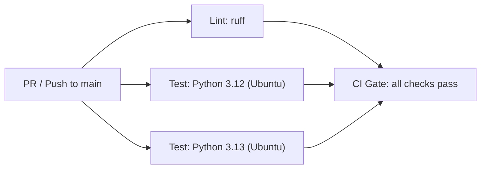
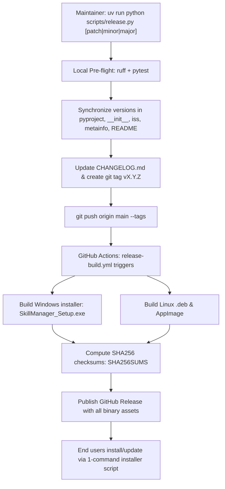

# CI/CD Architecture

## Overview

SkillManager uses GitHub Actions with industry-standard practices: pinned action SHAs, reusable workflows, and automated release builds triggering on tag pushes.

## Workflows

```
.github/workflows/
├── ci.yml                    # PR + main push gate (lint + test + security)
├── release-build.yml         # Multi-platform packaging (Windows .exe + Linux .deb & AppImage)
├── _lint.yml                 # Ruff check + format (reusable)
├── _test-python.yml          # Test suite runner (reusable)
├── _build-pyinstaller.yml    # PyInstaller build for Windows (reusable)
└── _security-scan.yml        # pip-audit (reusable)
```

## CI Pipeline (`ci.yml`)

Triggers: push to `main`, pull requests, manual dispatch.



**Concurrency**: PR runs cancel on new push; main runs queue.

---

## Release Pipeline (`release-build.yml`)

Releases are triggered by pushing a version tag `v*` (via `scripts/release.py`):



The Release workflow compiles all platform binaries on native GitHub runners, signs Windows installers (when certificate secrets are present), and attaches verified artifacts to the GitHub Release.

## Action Pinning

All third-party actions are pinned to full commit SHAs (not floating tags). Dependabot automatically proposes weekly updates.

| Action | SHA | Version |
|---|---|---|
| `actions/checkout` | `11bd7190...` | v4.2.2 |
| `actions/setup-python` | `a26af69b...` | v5.6.0 |
| `astral-sh/setup-uv` | `6b9c6063...` | v6.0.1 |
| `actions/upload-artifact` | `4cec3d8a...` | v4.6.1 |
| `actions/download-artifact` | `d3f86a10...` | v4.3.0 |
| `softprops/action-gh-release` | `da05d552...` | v2.2.2 |
| `peaceiris/actions-gh-pages` | `4f9cc660...` | v4.0.0 |
| `python-semantic-release/python-semantic-release` | — | v10.5.3 |

## Branch Protection (Recommended)

Apply via GitHub UI or `gh api`:

- `main`: require CI gate to pass, require 1 approval, no force push

## Secret Inventory

| Secret | Purpose | Required |
|---|---|---|
| `GITHUB_TOKEN` | Default token for releases | Yes (auto-provided) |

### Suppressed CVEs

See [docs/SECURITY.md](SECURITY.md) for the list of CVEs silenced in
`pip-audit --ignore-vuln` and the threat-model rationale.

## Local Parity

Run the same checks locally:

```bash
export QML_DISABLE_DISK_CACHE=1  # ADR-0001 — prevents stale QML bytecode
uv run ruff check src tests
uv run ruff format --check src tests
uv run pytest --cov=skill_manager --cov-fail-under=90
```

## Required Repo Settings

The Release workflow depends on the following repo-level setting (Settings → Actions → General → Workflow permissions):

- **Workflow permissions**: "Read and write permissions"
- **Allow GitHub Actions to create and approve pull requests**: enabled

## Troubleshooting

### Coverage below 90%

Check `tests/test_coverage_boost.py` for uncovered modules. Add targeted tests for the lowest-coverage source files.

### Semantic Release not creating release

Ensure commits on `main` include an opt-in token (`[patch]`, `[minor]`, `[major]`, or `[dev]`) in the subject line.

### Artifact upload fails

Check the specific build job logs in the [release workflow](https://github.com/dishanagalawatta/SkillManager/actions/workflows/release-build.yml).
