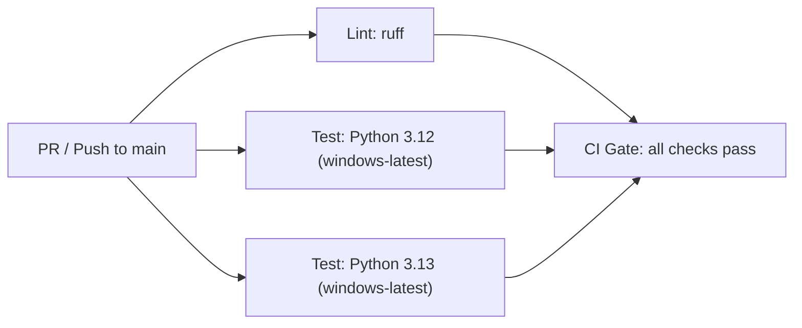
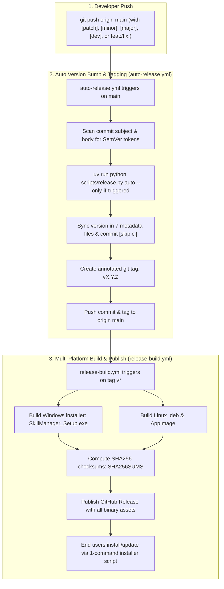
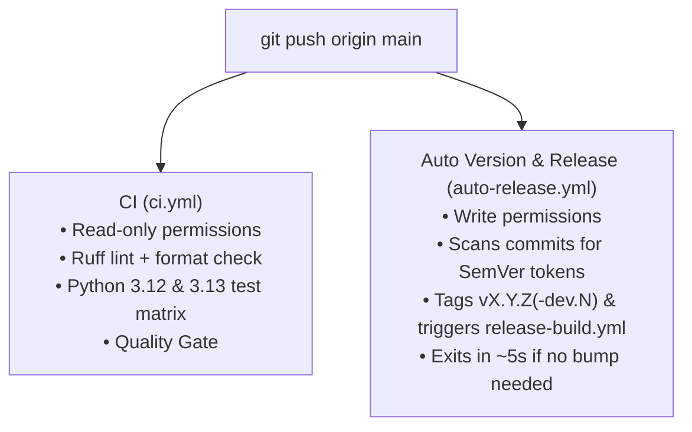

# CI/CD Architecture

## Overview

SkillManager uses GitHub Actions with industry-standard practices: pinned action SHAs, reusable workflows, and automated release builds triggering on tag pushes.

## Workflows

```
.github/workflows/
├── ci.yml                    # PR + main push gate (lint + test + security)
├── auto-release.yml          # Automated version bump and git tagging on main push
├── release-build.yml         # Multi-platform packaging (Windows .exe + Linux .deb & AppImage)
├── _lint.yml                 # Ruff check + format (reusable)
├── _test-python.yml          # Test suite runner (reusable)
├── _build-pyinstaller.yml    # PyInstaller build for Windows (reusable)
└── _security-scan.yml        # pip-audit (reusable)
```

## CI Pipeline (`ci.yml`)

Triggers: push to `main`, pull requests, manual dispatch.



**Concurrency**: PR runs cancel on new push; main runs queue.

---

## Automated Versioning & Release Pipeline (`auto-release.yml` & `release-build.yml`)

Releases are fully automated from Git commits and tags:



The Release workflow compiles all platform binaries on native GitHub runners, signs Windows installers (when certificate secrets are present), and attaches verified artifacts to the GitHub Release.

Dev pre-releases (`vX.Y.Z-dev.N` tags) are published with `prerelease: true` and are skipped by the GitHub `/releases/latest` endpoint, so stable users never receive them via `install.sh --update` or the in-app update check. A `[patch]` commit while a dev line is active promotes it to stable. See [VERSIONING.md §4](VERSIONING.md#4-pre-release-versions).

## Action Pinning

All third-party actions are pinned to full commit SHAs (not floating tags). Dependabot automatically proposes weekly updates.

| Action | SHA | Version |
|---|---|---|
| `actions/checkout` | `3d3c42e5...` | v7.0.1 |
| `actions/setup-python` | `5fda3b95...` | v7.0.0 |
| `astral-sh/setup-uv` | `c18668ad...` | v10.2.0 |
| `actions/upload-artifact` | `043fb46d...` | v7.0.1 |
| `actions/download-artifact` | `3e5f45b2...` | v8 |
| `softprops/action-gh-release` | `efb35369...` | v3 |
| `zizmorcore/zizmor-action` | `cc914d7f...` | v0.6.4 |

---

## Dual-Workflow Architecture on `main` Push

When a push to `main` occurs, GitHub Actions triggers two distinct workflows in parallel:



### Why They Are Decoupled
1. **Security Isolation (Least Privilege)**: `CI` runs on untrusted Pull Requests with strictly read-only repository permissions (`contents: read`). `Auto Version & Release` requires write permissions (`contents: write`, `actions: write`) to push tags and dispatch workflows, and is locked to `main`.
2. **Speed & Efficiency**: `auto-release.yml` performs an instantaneous pre-flight check via `scripts/release.py auto --only-if-triggered`. If no SemVer tokens are found, it terminates in ~5 seconds without consuming heavy runner minutes.
3. **Pull Request Support**: `ci.yml` validates PRs to prevent broken code from landing on `main`, while release automation only acts once changes are merged to `main`.

### `paths-ignore` & Lockfile Behavior
Both `ci.yml` and `auto-release.yml` ignore changes restricted strictly to documentation and reference directories:
```yaml
paths-ignore:
  - 'docs/**'
  - '*.md'
  - 'assets/**'
  - '.agents/**'
  - 'image/**'
  - 'conductor/**'
  - 'LICENSE'
```
- **Doc-only commits** (`docs/`, `README.md`, etc.) are skipped automatically by GitHub Actions.
- **Dependency & lockfile updates** ([`uv.lock`](file:///home/dikka/Documents/01-Projects/27-SkillManager/skill-manager/uv.lock)) or code changes are **not** ignored, triggering both workflows to ensure all tests pass and any release tokens are processed.

---

## Branch Protection (Recommended)

Apply via GitHub UI or `gh api`:

- `main`: require CI gate to pass, require 1 approval, no force push

## Secret Inventory

| Secret | Purpose | Required |
|---|---|---|
| `GITHUB_TOKEN` | Default token for releases | Yes (auto-provided) |
| `WIN_PFX_B64` | Base64-encoded Windows code signing certificate | Optional |
| `WIN_PFX_PASS` | Password for Windows code signing certificate | Optional |

### Suppressed CVEs

See [docs/SECURITY.md](SECURITY.md) for the list of CVEs silenced in
`pip-audit --ignore-vuln` and the threat-model rationale.

## Local Parity

Run the same checks locally:

```bash
export QML_DISABLE_DISK_CACHE=1  # ADR-0001 — prevents stale QML bytecode
uv run ruff check src tests
uv run ruff format --check src tests
uv run pytest --cov=skill_manager --cov-fail-under=80
```

## Required Repo Settings

The Release workflow depends on the following repo-level setting (Settings → Actions → General → Workflow permissions):

- **Workflow permissions**: "Read and write permissions"
- **Allow GitHub Actions to create and approve pull requests**: enabled

## Troubleshooting

### Windows CI fixture rules

The test jobs run on `windows-latest`, so pytest fixtures must be
portable — Linux-green tests have repeatedly broken CI:

- **No backslashes or double quotes in fixture file/dir names.**
  Backslash is a path separator on Windows (`Path("a\\b")` creates two
  levels) and `"` is illegal in Windows names (`WinError 123`). Cover
  backslash-sensitive parsing with platform-independent unit tests and
  guard fixture round-trips with
  `@pytest.mark.skipif(os.name == "nt", reason=...)`.
- **Guard `os.mkfifo` with `(OSError, AttributeError)`.** `os.mkfifo`
  does not exist on Windows — access raises `AttributeError`, not
  `OSError`.
- **Prefer the shared walk in tests too.** When asserting traversal
  behavior, compare against `iter_relative_files()` rather than a
  second inline `os.walk` reference where possible.

### Coverage below threshold
Check `tests/test_coverage_boost.py` for uncovered modules. Add targeted tests for the lowest-coverage source files.

### Auto Release not creating release
Ensure commits on `main` include an opt-in SemVer token (`[patch]`, `[minor]`, `[major]`, or `[dev]`) or Conventional Commit prefix (`feat!:`, `feat:`, `fix:`, `perf:`) in the commit subject or body.

### Artifact upload fails
Check the specific build job logs in the [release workflow](https://github.com/dishanagalawatta/SkillManager/actions/workflows/release-build.yml).
