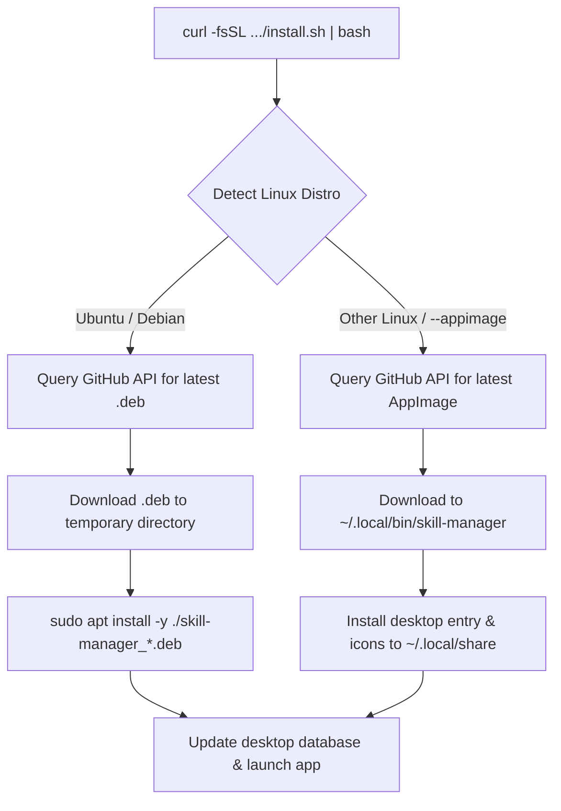

# Installing SkillManager

SkillManager provides fast, automated 1-command installation and update workflows for Linux and Windows.

---

## 1. Linux & Ubuntu (Recommended: 1-Command Script)

No repository cloning or Python dependencies required. The universal installer automatically detects your Linux distribution, resolves required Qt/system dependencies via `apt`, downloads the latest release, verifies its integrity against the published `SHA256SUMS` manifest, and configures application icons and `.desktop` launchers.



### Install / Upgrade to Latest Version

```bash
curl -fsSL https://raw.githubusercontent.com/dishanagalawatta/SkillManager/main/scripts/install.sh | bash
```

*(On Ubuntu and Debian systems, this installs the official `.deb` package. On other Linux distributions, it installs the portable AppImage to `~/.local/bin/skill-manager`).*

### Update SkillManager

Check for the latest release and update seamlessly in one command:

```bash
curl -fsSL https://raw.githubusercontent.com/dishanagalawatta/SkillManager/main/scripts/install.sh | bash -s -- --update
```

> **Switching package types (AppImage → deb):** If the previous installation was an AppImage
> (or any other user-level binary at `~/.local/bin/skill-manager`), the updater installs the
> `.deb` *alongside* the old binary instead of replacing it. Because `~/.local/bin` often
> precedes `/usr/bin` in `PATH`, your terminal may keep launching the old version even after a
> successful update. The installer detects this conflict and prints a warning with the exact
> command to remove the shadowing binary:
>
> ```bash
> rm -f ~/.local/bin/skill-manager
> ```

### Installing a Specific Version (incl. Dev Builds)

```bash
# Install a specific stable version
curl -fsSL https://raw.githubusercontent.com/dishanagalawatta/SkillManager/main/scripts/install.sh | bash -s -- --version 2.2.3

# Install a specific dev pre-release (e.g. v2.2.5-dev.1)
curl -fsSL https://raw.githubusercontent.com/dishanagalawatta/SkillManager/main/scripts/install.sh | bash -s -- --version 2.2.5-dev.1
```

Dev pre-releases (`x.y.z-dev.n`) are published as GitHub **prereleases** and are
**excluded** from `--update` and the in-app update check — both resolve the
`/releases/latest` endpoint, which skips prereleases. Installing a dev build
requires the explicit `--version` flag above; a later `--update` moves you back
to the latest stable release. See [VERSIONING.md §4](VERSIONING.md#4-pre-release-versions).

### Uninstall

Remove the application and desktop entries cleanly:

```bash
curl -fsSL https://raw.githubusercontent.com/dishanagalawatta/SkillManager/main/scripts/install.sh | bash -s -- --uninstall
```

To also delete all user settings, databases, and cache, append `--purge`:

```bash
curl -fsSL https://raw.githubusercontent.com/dishanagalawatta/SkillManager/main/scripts/install.sh | bash -s -- --uninstall --purge
```

### Advanced Script Options

| Option | Description |
|---|---|
| `--update`, `-u` | Check for updates and install if a newer version exists |
| `--uninstall` | Remove SkillManager and desktop shortcuts |
| `--purge` | With `--uninstall`: removes `~/.config/SkillManager` and user data |
| `--deb` | Force installation via Debian package (`.deb`) |
| `--appimage` | Force installation via portable `AppImage` |
| `-v`, `--version <VER>` | Install a specific version (e.g. `2.0.0` or `v2.0.0`) |
| `--dry-run` | Print actions without making filesystem modifications |
| `-y`, `--yes` | Run non-interactively, accepting all prompts |

---

## 2. Windows (Recommended: winget)

```powershell
winget install --id dishanagalawatta.SkillManager -e --source winget
```

This installs SkillManager via Windows Package Manager. The binary is distributed through Microsoft's package index with verified hashes, so **no SmartScreen warnings appear**.

### Update (Windows)

```powershell
winget upgrade --id dishanagalawatta.SkillManager
```

### Uninstall (Windows)

```powershell
winget uninstall --id dishanagalawatta.SkillManager
```

---

## 3. Manual Downloads (Direct Releases)

Download pre-built packages from [GitHub Releases](https://github.com/dishanagalawatta/SkillManager/releases):

### Windows Installer (.exe)
1. Download `SkillManager_Setup.exe`.
2. Run the installer (if SmartScreen appears, click **More info** → **Run anyway**).
3. Verify file integrity:
   ```powershell
   Get-FileHash .\SkillManager_Setup.exe -Algorithm SHA256
   ```

### Debian / Ubuntu Package (.deb)
```bash
sudo dpkg -i skill-manager_<version>_amd64.deb
sudo apt-get install -f  # resolves any missing dependencies
```

### Standalone Linux AppImage
```bash
chmod +x SkillManager-<version>-x86_64.AppImage
./SkillManager-<version>-x86_64.AppImage
```

*(If FUSE is not installed on your system, run with `./SkillManager-<version>-x86_64.AppImage --appimage-extract-and-run`).*

---

## 4. Developer Setup (From Source)

Requires Python 3.12+ and [uv](https://docs.astral.sh/uv/).

```bash
# Clone repository
git clone https://github.com/dishanagalawatta/SkillManager.git
cd SkillManager

# Sync dependencies into virtualenv
uv sync

# Run application
uv run skill-manager
```

### Building Installers Locally

- **Linux (`.deb` + `AppImage`)**:
  ```bash
  uv run python scripts/build_linux.py --all
  ```
- **Windows Setup (`SkillManager_Setup.exe`)**:
  ```powershell
  .\packaging\windows\build.ps1 -SkipSign
  ```

---

## 5. Troubleshooting

### "Could not load the Qt platform plugin 'xcb'"
Install the missing XCB cursor library:
```bash
sudo apt install -y libxcb-cursor0
```

### Global hotkey not working on Wayland
Ensure `xdg-desktop-portal` is installed and active on your desktop:
```bash
sudo apt install -y xdg-desktop-portal
```

### Native Clipboard Integration on Linux (Wayland / X11)
SkillManager features direct dual-write clipboard operations. For reliable native clipboard support:
- On **Wayland**: `sudo apt install -y wl-clipboard`
- On **X11**: `sudo apt install -y xclip` (or `xsel`)

The 1-command installer script and `.deb` packages configure this dependency automatically.

### "skill-manager" still launches the old version after updating
A leftover user-level binary (an earlier AppImage install or a development symlink) at
`~/.local/bin/skill-manager` shadows the system package whenever `~/.local/bin` precedes
`/usr/bin` in `PATH`. The updater prints a warning when it detects this conflict. Remove
the shadowing binary to use the packaged version:

```bash
rm -f ~/.local/bin/skill-manager
```

### apt prints "Download is performed unsandboxed as root ... Permission denied"
Benign notice shown when apt's `_apt` sandbox user cannot read the `.deb` staged in a private
temporary directory. Current installer versions create the staging directory with
world-readable permissions (`chmod 0755`), which suppresses the notice. Older script versions
may still show it — it is safe to ignore.

### Install aborts with "Checksum mismatch"
Every download is verified against the release's `SHA256SUMS` manifest before installation.
A mismatch means the file is corrupt or tampered with, so the installer aborts. Simply re-run
the command to download the artifact again; if the failure persists, the release assets may
be corrupted — please [report it](https://github.com/dishanagalawatta/SkillManager/issues).
