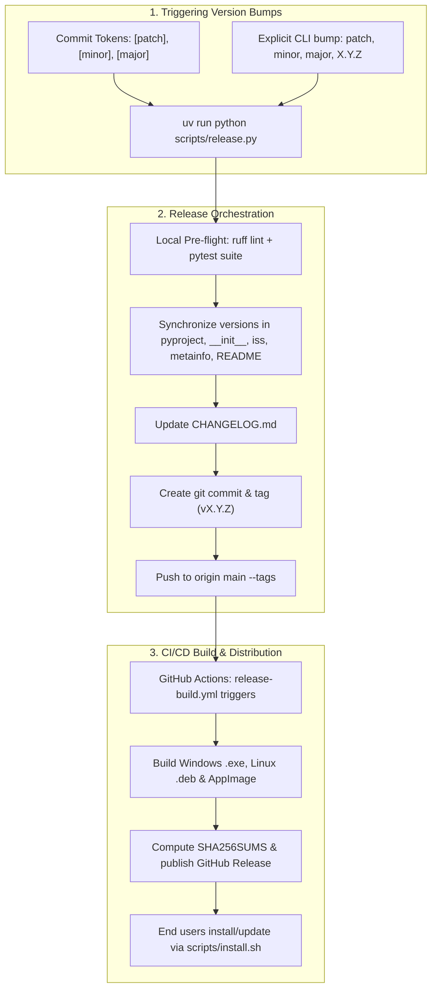

# Release Guide

This document explains the full release and versioning lifecycle for SkillManager.

---

## Overview

SkillManager supports two unified release mechanisms: **Commit-Based Opt-in Tokens** and the **Automated Release CLI (`scripts/release.py`)**:



---

## Method 1: Commit-Based Version Bumping

You can declare version bumps directly within your Git commit messages using opt-in tokens:

| Token / Prefix | Bump Type | Result | Example Commit |
|---|---|---|---|
| `[patch]` / `fix:` | Patch | `x.y.z` → `x.y.(z+1)` | `fix: correct dropdown alignment [patch]` |
| `[minor]` / `feat:` | Minor | `x.y.z` → `x.(y+1).0` | `feat: add new search filter [minor]` |
| `[major]` / `feat!:` | Major | `x.y.z` → `(x+1).0.0` | `feat!: redesign configuration API [major]` |
| `[dev]` | Pre-release | `x.y.z` → `x.y.z-dev.N` | `fix: experiment with snapshot capture [dev]` |

Commits **without** a token (e.g. `docs: update README`, `chore: lint`) will not trigger a version bump.

When ready to cut the release, running `uv run python scripts/release.py` will automatically inspect all unreleased commits since the last tag, calculate the highest priority bump (`major` > `minor` > `patch`), and apply it across all repository files.

---

## Method 2: Automated Release CLI (`scripts/release.py`)

Run the release script directly from the repository root:

```bash
# Auto-detect bump from unreleased commit tokens
uv run python scripts/release.py

# Or force an explicit bump:
uv run python scripts/release.py patch   # 1.9.0 -> 1.9.1
uv run python scripts/release.py minor   # 1.9.0 -> 1.10.0
uv run python scripts/release.py major   # 1.9.0 -> 2.0.0

# Or set an explicit version:
uv run python scripts/release.py 1.9.5
```

### CLI Flags

| Flag | Description |
|---|---|
| `--dry-run` | Simulate the entire release and version synchronization without making changes |
| `--skip-tests` | Skip executing `pytest` suite during pre-flight checks |
| `--skip-lint` | Skip executing `ruff` linter during pre-flight checks |
| `--no-push` | Stage, commit, and tag locally without pushing to `origin` |
| `-m`, `--message` | Custom commit and release tag message |

---

## Release Pipeline Step-by-Step

### 1. Pre-flight Checks
The release script ensures the working directory is clean and executes:
- `uv run ruff check src tests`
- `uv run pytest -n auto`

### 2. Version Synchronization
The version is synchronized across all repository components in lockstep:
- `pyproject.toml` (`[project].version`)
- `src/skill_manager/__init__.py` (`__version__`)
- `packaging/windows/installer.iss` (`#define MyAppVersion`)
- `packaging/linux/org.dishanagalawatta.SkillManager.metainfo.xml` (`<release version="...">`)
- `README.md` (version badge)
- `CHANGELOG.md` (release entry)

### 3. Git Tag & Push
The script creates an annotated tag `vX.Y.Z` and pushes to `origin main --tags`.

### 4. GitHub Actions Release Workflow (`release-build.yml`)
When tag `v*` is pushed:
1. **Windows Build Job**: Builds PyInstaller bundle and Inno Setup installer (`SkillManager_Setup.exe`).
2. **Linux Build Job**: Compiles PyInstaller binary, builds `.deb` (`skill-manager_<version>_amd64.deb`), and builds portable `AppImage` (`SkillManager-<version>-x86_64.AppImage`).
3. **Publish Job**: Computes SHA256 checksums (`SHA256SUMS`) and creates the GitHub Release with attached assets.

### 5. End-User 1-Command Installation
Once published, end users can immediately install or upgrade via the 1-command installer script:
```bash
curl -fsSL https://raw.githubusercontent.com/dishanagalawatta/SkillManager/main/scripts/install.sh | bash -s -- --update
```
