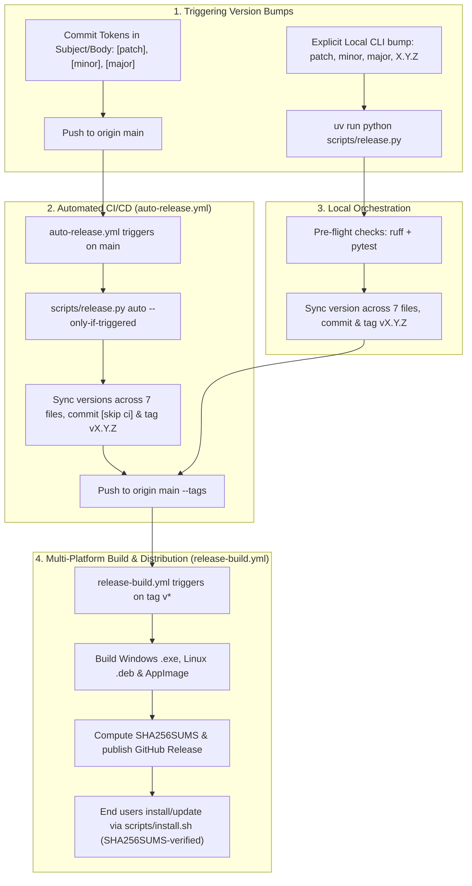

# Release Guide

This document explains the full release and versioning lifecycle for SkillManager.

---

## Overview

SkillManager supports two unified release mechanisms: **Commit-Based Opt-in Tokens** (fully automated via GitHub Actions) and the **Local Release CLI (`scripts/release.py`)**:



---

## Method 1: Commit-Based Automated Version Bumping

You can declare version bumps directly within your Git commit messages using opt-in tokens in the **subject or body**:

| Token / Prefix | Bump Type | Result | Example Commit |
|---|---|---|---|
| `[patch]` / `fix:` | Patch | `x.y.z` → `x.y.(z+1)` | `fix: correct dropdown alignment [patch]` |
| `[minor]` / `feat:` | Minor | `x.y.z` → `x.(y+1).0` | `feat: add new search filter [minor]` |
| `[major]` / `feat!:` | Major | `x.y.z` → `(x+1).0.0` | `feat!: redesign configuration API [major]` |
| `[dev]` | Pre-release | `x.y.z` → `x.y.(z+1)-dev.1` | `fix: experiment with snapshot capture [dev]` |

### How It Operates
1. Include the token anywhere in your commit message (e.g. `feat: add quick copy button [minor]` or in a bullet point inside the commit body `* Added new filter. [minor]`).
2. When pushed to `main`, GitHub Actions (`.github/workflows/auto-release.yml`) scans all commits since the previous release tag.
3. If an unreleased token is detected, it runs `scripts/release.py auto`, commits the version sync across all 7 metadata files, creates the `vX.Y.Z` git tag, and pushes to GitHub.
4. The tag push immediately triggers `.github/workflows/release-build.yml` to compile and publish the multi-platform release.

Commits **without** a token (e.g. `docs: update README`, `chore: lint`) will not trigger a version bump.

---

## Method 2: Automated Release CLI (`scripts/release.py`)

Run the release script directly from the repository root:

```bash
# Auto-detect bump from unreleased commit tokens
uv run python scripts/release.py

# Or force an explicit bump:
uv run python scripts/release.py patch   # 2.0.0 -> 2.0.1
uv run python scripts/release.py minor   # 2.0.0 -> 2.1.0
uv run python scripts/release.py major   # 2.0.0 -> 3.0.0
uv run python scripts/release.py dev     # 2.0.0 -> 2.0.1-dev.1

# Or set an explicit version:
uv run python scripts/release.py 2.0.1
uv run python scripts/release.py 2.0.1-dev.1
```

### CLI Flags

| Flag | Description |
|---|---|
| `--dry-run` | Simulate the entire release and version synchronization without making changes |
| `--skip-tests` | Skip executing `pytest` suite during pre-flight checks |
| `--skip-lint` | Skip executing `ruff` linter during pre-flight checks |
| `--no-push` | Stage, commit, and tag locally without pushing to `origin` |
| `-m`, `--message` | Custom commit and release tag message |

---

## Release Pipeline Step-by-Step

### 1. Pre-flight Checks
The release script ensures the working directory is clean and executes:
- `uv run ruff check src tests`
- `uv run pytest -n auto`

### 2. Version Synchronization
The version is synchronized across all repository components in lockstep:
- `pyproject.toml` (`[project].version`)
- `uv.lock` (regenerated via `uv lock` so the lockfile version never drifts)
- `src/skill_manager/__init__.py` (`__version__`)
- `packaging/windows/installer.iss` (`#define MyAppVersion`)
- `packaging/linux/org.dishanagalawatta.SkillManager.metainfo.xml` (`<release version="...">`)
- `README.md` (version badge)
- `CHANGELOG.md` (release entry)

### 3. Git Tag & Push
The script creates an annotated tag `vX.Y.Z` and pushes to `origin main --tags`.

### 4. GitHub Actions Release Workflow (`release-build.yml`)
When tag `v*` is pushed:
1. **Windows Build Job**: Builds PyInstaller bundle and Inno Setup installer (`SkillManager_Setup.exe`).
2. **Linux Build Job**: Compiles PyInstaller binary, builds `.deb` (`skill-manager_<version>_amd64.deb`), and builds portable `AppImage` (`SkillManager-<version>-x86_64.AppImage`).
3. **Publish Job**: Computes SHA256 checksums (`SHA256SUMS`) and creates the GitHub Release with attached assets.
4. **Pre-releases** (`vX.Y.Z-dev.N` tags) are published with `prerelease: true`, so they are skipped by the GitHub `/releases/latest` endpoint. Stable users never see them via `install.sh --update` or the in-app update check; only explicit `--version` installs target a dev build. See [VERSIONING.md §4](VERSIONING.md#4-pre-release-versions).

### 5. End-User 1-Command Installation
Once published, end users can immediately install or upgrade via the 1-command installer script:
```bash
curl -fsSL https://raw.githubusercontent.com/dishanagalawatta/SkillManager/main/scripts/install.sh | bash -s -- --update
```
The installer verifies every downloaded artifact against the release `SHA256SUMS` manifest
before installation and aborts on any mismatch (see [docs/SECURITY.md](SECURITY.md)).
