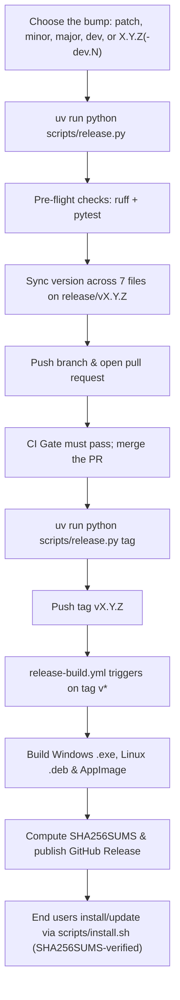
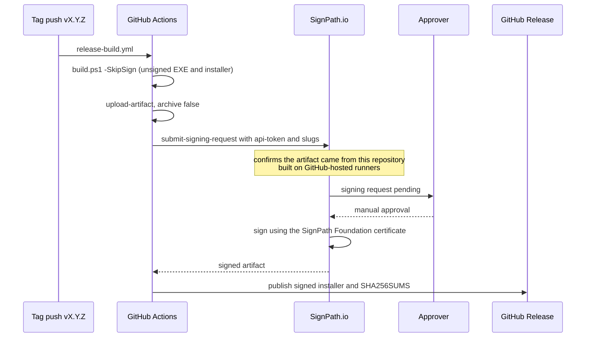

# Release Guide

This document explains the full release and versioning lifecycle for SkillManager.

---

## Overview

Releases are cut **manually** in two steps: `scripts/release.py <bump>`
synchronises every version location onto a `release/vX.Y.Z` branch and opens a
pull request; after that merges, `scripts/release.py tag` tags the merge commit,
and the tag triggers the build.


```mermaid
flowchart TD
    A["Choose the bump: patch, minor, major, dev, or X.Y.Z(-dev.N)"] --> B["uv run python scripts/release.py <bump>"]
    B --> C["Pre-flight checks: ruff + pytest"]
    C --> D["Sync version across 7 files on release/vX.Y.Z"]
    D --> E["Push branch & open pull request"]
    E --> F["CI Gate must pass; merge the PR"]
    F --> G["uv run python scripts/release.py tag"]
    G --> H["Push tag vX.Y.Z"]
    H --> I["release-build.yml triggers on tag v*"]
    I --> J["Build Windows .exe, Linux .deb & AppImage"]
    J --> K["Compute SHA256SUMS & publish GitHub Release"]
    K --> L["End users install/update via scripts/install.sh (SHA256SUMS-verified)"]
```

Nothing is inferred from commit messages: pushing to `main` never bumps the
version or creates a tag, and no workflow does it on your behalf. `main` is
protected, so even the release commit arrives through a pull request.

---

## Cutting a Release

Run the release script from the repository root with an explicit target:

```bash
uv run python scripts/release.py patch   # 2.13.0 -> 2.13.1
uv run python scripts/release.py minor   # 2.13.0 -> 2.14.0
uv run python scripts/release.py major   # 2.13.0 -> 3.0.0
uv run python scripts/release.py dev     # 2.13.0 -> 2.13.1-dev.1

# Or name the version outright:
uv run python scripts/release.py 2.14.0
uv run python scripts/release.py 2.14.0-dev.1
```

The bump argument is **required**: there is no default, no `auto` mode, and no
detection from commit messages. Review `git log` and choose deliberately.

That opens a pull request from `release/vX.Y.Z`. Once `CI Gate` is green and the
PR is merged, tag the merge commit:

```bash
git pull
uv run python scripts/release.py tag
```

`tag` reads the version from `pyproject.toml`, refuses to run off `main` or with a
dirty working tree, and pushes `vX.Y.Z` — the push that starts `release-build.yml`.
It also refuses to reuse an existing tag.

### CLI Flags

| Flag | Description |
|---|---|
| `--dry-run` | Simulate the entire release and version synchronization without making changes |
| `--skip-tests` | Skip executing `pytest` suite during pre-flight checks |
| `--skip-lint` | Skip executing `ruff` linter during pre-flight checks |
| `--no-push` | Create the release branch and commit locally, without pushing or opening the PR |
| `-m`, `--message` | Custom commit message, also used as the PR title |

### Releasing with uncommitted local work

`release.py` refuses to run unless `git status --porcelain` is empty, and it
assumes it is on `main` because it creates `release/vX.Y.Z` itself. If you have
unrelated changes you do not want to commit or stash, cut the release from a
separate clone — a worktree cannot be used, since `main` is already checked out
in the original and the script needs it free:

```bash
git clone https://github.com/dishanagalawatta/SkillManager.git /tmp/release-x.y.z
cd /tmp/release-x.y.z
uv run python scripts/release.py <bump>
```

In this case the release branch lives only in the clone. Push it and open the PR
from there, and delete the clone once the tag is pushed.

---

## Release Pipeline Step-by-Step

### 1. Pre-flight Checks
The release script ensures the working directory is clean and executes:
- `uv run ruff check src tests`
- `uv run pytest -n auto`

### 2. Version Synchronization
The version is synchronized across all repository components in lockstep:
- `pyproject.toml` (`[project].version`)
- `uv.lock` (regenerated via `uv lock` so the lockfile version never drifts)
- `src/skill_manager/__init__.py` (`__version__`)
- `packaging/windows/installer.iss` (`#define MyAppVersion`)
- `packaging/linux/org.dishanagalawatta.SkillManager.metainfo.xml` (`<release version="...">`)
- `README.md` (version badge)
- `CHANGELOG.md` (release entry)

### 3. Release PR & Tag
`scripts/release.py` cuts `release/vX.Y.Z` from `main`, commits the synchronized
files, pushes the branch, and opens a pull request. `main` is protected, so this is
the only way the bump can land. After `CI Gate` passes and the PR merges,
`scripts/release.py tag` creates the annotated tag `vX.Y.Z` on `main` and pushes
it; that push is what starts the build.

### 4. GitHub Actions Release Workflow (`release-build.yml`)
When tag `v*` is pushed:
1. **Windows Build Job**: Builds PyInstaller bundle and Inno Setup installer (`SkillManager_Setup.exe`).
2. **Linux Build Job**: Compiles PyInstaller binary, builds `.deb` (`skill-manager_<version>_amd64.deb`), and builds portable `AppImage` (`SkillManager-<version>-x86_64.AppImage`).
3. **Publish Job**: Computes SHA256 checksums (`SHA256SUMS`) and creates the GitHub Release with attached assets.
4. **Pre-releases** (`vX.Y.Z-dev.N` tags) are published with `prerelease: true`, so they are skipped by the GitHub `/releases/latest` endpoint. Stable users never see them via `install.sh --update` or the in-app update check; only explicit `--version` installs target a dev build. See [VERSIONING.md §4](VERSIONING.md#4-pre-release-versions).

### 5. End-User 1-Command Installation
Once published, end users can immediately install or upgrade via the 1-command installer script:
```bash
curl -fsSL https://raw.githubusercontent.com/dishanagalawatta/SkillManager/main/scripts/install.sh | bash -s -- --update
```
The installer verifies every downloaded artifact against the release `SHA256SUMS` manifest
before installation and aborts on any mismatch (see [docs/SECURITY.md](SECURITY.md)).

### 6. Windows Package Manager (winget) — manual, out-of-band
`winget` is **not** published yet, so `winget install --id dishanagalawatta.SkillManager`
currently fails with *"No package found matching input criteria."* Nothing in
`release-build.yml` submits it; the manifest is published by hand to
[`microsoft/winget-pkgs`](https://github.com/microsoft/winget-pkgs).

After a release, copy the newest version folder under
[`packaging/winget/manifests/`](../packaging/winget/README.md) to one named for the new
version, update `PackageVersion`, `InstallerUrl`, `InstallerSha256` (uppercase, from the
release `SHA256SUMS`), `ReleaseDate`, and `ReleaseNotesUrl`, then open a PR adding **only
that folder**. The first submission (v1.8.0,
[#391299](https://github.com/microsoft/winget-pkgs/pull/391299)) was closed as *Stale*
without review. See [`packaging/winget/README.md`](../packaging/winget/README.md) for the
full checklist and the verified values for v2.12.1.

### 7. Post-release verification

Confirm the published artifacts are the ones you built and that the app's own
update path works in a **packaged** build (the automatic check only runs when
`sys.frozen` is true, so a source checkout will not exercise it):

```bash
mkdir -p /tmp/verify && cd /tmp/verify
curl -sLO https://github.com/dishanagalawatta/SkillManager/releases/download/vX.Y.Z/SHA256SUMS
curl -sLO https://github.com/dishanagalawatta/SkillManager/releases/download/vX.Y.Z/SkillManager-X.Y.Z-x86_64.AppImage
# SHA256SUMS lists paths under dist/, so mirror that layout
mkdir -p dist && mv SkillManager-X.Y.Z-x86_64.AppImage dist/ && sha256sum -c SHA256SUMS

chmod +x dist/SkillManager-X.Y.Z-x86_64.AppImage && dist/SkillManager-X.Y.Z-x86_64.AppImage
```

Without touching the UI, `~/.local/share/SkillManager/skill_manager.log` should
show a check a few seconds after the window appears:

```
... skill_manager.controllers.app_update_controller - INFO - SkillManager is up to date.
```

If the tag you just released *is* the latest, "up to date" is the expected
result; the same line proves the daily timer and toast path are wired. Also check
that <https://api.github.com/repos/dishanagalawatta/SkillManager/releases/latest>
returns the new tag, since `install.sh --update` and the in-app check both read
that endpoint.

## Windows Code Signing

Windows installers are currently **unsigned**. `release-build.yml` signs only
when the `WIN_PFX_B64` secret is set; that secret no longer exists — it was
destroyed on 2026-10-19 when the repository was recreated, together with the
certificate it held — so the signing step never runs, `sign.ps1` exits with
`SKIP_SIGN`, and SmartScreen shows "More info → Run anyway" on first run (see
[INSTALL.md](INSTALL.md)). Signing returns only with SignPath.

Signing is moving to [SignPath Foundation](https://signpath.org), which issues
certificates to open-source projects free of charge. It is the only free route:
Certum's open-source tier became paid in 2016, Azure Artifact Signing needs a
billed subscription, and a physical token cannot be reached from GitHub-hosted
runners. The previous mechanism cannot simply be re-pointed at a new
certificate — since June 2023 no publicly trusted CA issues an exportable key —
so see [SECURITY.md § Code-Signing Key Exposure & Rotation](SECURITY.md) for the
rationale and the revocation duty.

**Status: application not yet submitted.** Everything below is prepared and
inert until `SIGNPATH_API_TOKEN` exists.

### Signing lifecycle


```mermaid
sequenceDiagram
    participant Tag as Tag push vX.Y.Z
    participant CI as GitHub Actions
    participant SP as SignPath.io
    participant Approver as Approver
    participant Rel as GitHub Release

    Tag->>CI: release-build.yml
    CI->>CI: build.ps1 -SkipSign (unsigned EXE and installer)
    CI->>CI: upload-artifact, archive false
    CI->>SP: submit-signing-request with api-token and slugs
    Note over SP: confirms the artifact came from this repository<br/>built on GitHub-hosted runners
    SP->>Approver: signing request pending
    Approver-->>SP: manual approval
    SP->>SP: sign using the SignPath Foundation certificate
    SP-->>CI: signed artifact
    CI->>Rel: publish signed installer and SHA256SUMS
```

### Prerequisites (already in place)

- **EXE product metadata.** SignPath's artifact policy requires ProductName and
  ProductVersion to be set and identical across a build. `SkillManager.exe` had
  none; `packaging/windows/version_info.py` now generates the version resource
  from `pyproject.toml` and the spec passes it to `EXE()`. Keep the generated
  values in step with the release — `tests/test_version_sync.py` fails if the
  generator and `pyproject.toml` disagree.
- **Code signing policy** published in [README.md](../README.md), with the
  attribution line and the reviewer/approver roles.
- **All jobs on GitHub-hosted runners**, and the installer is already uploaded as
  a workflow artifact before the release job runs.

### Workflow changes to apply once approved

Replace the "Decode signing cert" step and the secret-gated `build.ps1`
invocation in `release-build.yml`:

```yaml
- name: Build installer (unsigned)
  shell: pwsh
  run: .\packaging\windows\build.ps1 -SkipSign

- name: Upload unsigned installer
  id: upload-unsigned
  uses: actions/upload-artifact@<pinned-sha>
  with:
    name: SkillManager_Setup_unsigned
    path: dist/SkillManager_Setup.exe
    archive: false                 # SignPath wants the raw file, not a ZIP
    if-no-files-found: error

- name: Sign installer
  uses: signpath/github-action-submit-signing-request@<pinned-sha>
  with:
    api-token: ${{ secrets.SIGNPATH_API_TOKEN }}
    organization-id: '<organization id>'
    project-slug: 'skillmanager'
    signing-policy-slug: 'release-signing'
    github-artifact-id: ${{ steps.upload-unsigned.outputs.artifact-id }}
    wait-for-completion: true
    output-artifact-directory: dist
    skip-decompress: true          # pairs with archive: false

- name: Re-upload signed installer
  uses: actions/upload-artifact@<pinned-sha>
  with:
    name: SkillManager_Setup      # the name publish-release expects
    path: dist/SkillManager_Setup.exe
    if-no-files-found: error
```

Pin both `uses:` to full commit SHAs, matching every other action in the
workflow. The `WIN_PFX_B64` and `WIN_PFX_PASS` secrets no longer exist, so the
"Decode signing cert" step is permanently inert; `sign.ps1` is unused by CI and
can be kept for local signing or removed.

`build.ps1` currently signs **both** `dist\SkillManager\SkillManager.exe` and the
installer. The SignPath artifact configuration must cover both if both are to
carry a signature, otherwise only the installer is signed.

### Verification

```powershell
Get-AuthenticodeSignature .\SkillManager_Setup.exe | Format-List Status, SignerCertificate
```

`Status` must read `Valid` and the signer must be **SignPath Foundation** — not
your own name, because the certificate is issued to the foundation. Confirm the
same for `dist\SkillManager\SkillManager.exe` if it is configured for signing.

### Constraints to plan around

- **Every release needs manual approval.** A tag push no longer publishes a
  signed installer on its own; the workflow stops until a signing request is
  approved. Budget for that in the release flow, and note it makes prerelease
  tags (`vX.Y.Z-dev.N`) need approval too.
- **The published identity changes.** Add/Remove Programs currently shows the
  `MyAppPublisher` value from `installer.iss` (`dishanagalawatta`) while the
  Authenticode signature will read *SignPath Foundation*. Align `installer.iss`
  once the certificate is in use; it cannot be compiled off Windows, so change it
  where the build can be verified.
- **Eligibility is not guaranteed.** SignPath can decline a project with too
  little public reputation, and their terms provide no appeal. If declined,
  revert the README policy section and revisit paid options.

